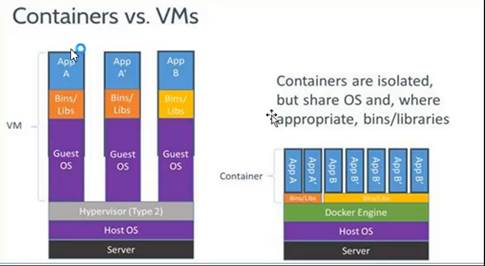

# Docker容器部署解决方案

v1.0.32_201905 By BoBo

课程目标：

- 熟悉Docker的相关概述：容器技术
- 掌握Docker的安装和启动
- 掌握Docker的镜像操作
- 掌握Docker的容器操作
- 掌握Docker的部署案例
- 熟悉Docker的备份和迁移


# 1. Docker概述


## 1.1 什么是虚拟化技术

> 在计算机中，虚拟化（英语：Virtualization）是一种资源管理技术，是将计算机的各种实体资源，如服务器、网络、内存及存储等，予以抽象、转换后呈现出来，打破实体结构间的不可切割的障碍，使用户可以比原本的组态更好的方式来应用这些资源。这些资源的新虚拟部份是不受现有资源的架设方式，地域或物理组态所限制。一般所指的虚拟化资源包括计算能力和资料存储。
>
> 在实际的生产环境中，虚拟化技术主要用来解决高性能的物理硬件产能过剩和老的旧的硬件产能过低的重组重用，透明化底层物理硬件，从而最大化的利用物理硬件。
>
> 虚拟化技术种类很多，例如：软件虚拟化、硬件虚拟化、内存虚拟化、网络虚拟化(vip)、桌面虚拟化、服务虚拟化、虚拟机等等。


## 什么是虚拟机

虚拟机（Virtual Machine）指通过软件模拟的具有完整硬件系统功能的、运行在一个完全隔离环境中的完整计算机系统。

常见的虚拟机软件有Vmware，VirtualBox等

## 什么是容器技术

【课后阅读】

在计算机的世界中，容器拥有一段漫长且传奇的历史。容器与管理程序虚拟化（hypervisor virtualization，HV）有所不同，管理程序虚拟化通过中间层将一台或者多台独立的机器虚拟运行与物理硬件之上，而容器则是直接运行在操作系统内核之上的用户空间。因此，容器虚拟化也被称为“操作系统级虚拟化”，容器技术可以让多个独立的用户空间运行在同一台宿主机上。

由于“客居”于操作系统，容器只能运行与底层宿主机相同或者相似的操作系统，这看起来并不是非常灵活。例如：可以在 Ubuntu 服务中运行 Redhat Enterprise Linux，但无法再Ubuntu 服务器上运行 Microsoft Windows。

相对于彻底隔离的管理程序虚拟化，容器被认为是不安全的。而反对这一观点的人则认为，由于虚拟容器所虚拟的是一个完整的操作系统，这无疑增大了攻击范围，而且还要考虑管理程序层潜在的暴露风险。

尽管有诸多局限性，容器还是被广泛部署于各种各样的应用场合。在超大规模的多租户服务部署、轻量级沙盒以及对安全要求不太高的隔离环境中，容器技术非常流行。最常见的一个例子就是“权限隔离监牢”（chroot jail），它创建一个隔离的目录环境来运行进程。

如果权限隔离监牢正在运行的进程被入侵者攻破，入侵者便会发现自己“身陷囹圄”，因为权限不足被困在容器所创建的目录中，无法对宿主机进一步破坏。

最新的容器技术引入了 OpenVZ、Solaris Zones 以及 Linux 容器（LXC）。使用这些新技术，容器不在仅仅是一个单纯的运行环境。在自己的权限类内，容器更像是一个完整的宿主机。对 Docker 来说，它得益于现代 Linux 特性，如控件组（control group）、命名空间（namespace）技术，容器和宿主机之间的隔离更加彻底，容器有独立的网络和存储栈，还拥有自己的资源管理能力，使得同一台宿主机中的多个容器可以友好的共存。
容器被认为是精益技术，因为容器需要的开销有限。和传统虚拟化以及半虚拟化相比，容器不需要模拟层（emulation layer）和管理层（hypervisor layer），而是使用操作系统的系统调用接口。这降低了运行单个容器所需的开销，也使得宿主机中可以运行更多的容器。

尽管有着光辉的历史，容器仍未得到广泛的认可。一个很重要的原因就是容器技术的复杂性：容器本身就比较复杂，不易安装，管理和自动化也很困难。而 Docker 就是为了改变这一切而生的。


容器技术有很多种，Docker是目前最流行的一种，服务器虚拟化解决的核心问题是资源调配，而容器解决的核心问题是应用开发、测试和部署。

虚拟机技术通过Hypervisor层抽象底层基础设施资源，提供相互隔离的虚拟机，通过统一配置、统一管理，计算资源的可运维性，以及资源利用率都能够得到有效的提升。同时，虚拟机提供客户机操作系统，客户机变化不会影响宿主机，能够提供可控的测试环境，更能够屏蔽底层硬件甚至基础软件的差异性，让应用做到的广泛兼容。然而，再牛逼的虚拟化技术，都不可避免地出现计算、IO、网络性能损失，毕竟多了一层软件，毕竟要运行一个完整的客户机操作系统。

容器技术严格来说并不是虚拟化，没有客户机操作系统，是共享内核的。容器可以视为软件供应链的集装箱，能够把应用需要的运行环境、缓存环境、数据库环境等等封装起来，以最简洁的方式支持应用运行，轻装上阵，当然是性能更佳。Docker镜像特性则让这种方式简单易行。当然，因为共享内核，容器隔离性也没有虚拟机那么好。

通过Docker的特性，以容器化封装为基础，企业就可以很好地实现云原生（向云而生的架构），包括微服务架构等，让开发团队可以从苦逼的运维工作中解脱，让应用快速上线、快速迭代。微服务架构下，将系统拆分成多个服务，每个部分都可以独立开发测试部署，同时我们也可以只扩展需要扩展的部分。

容器技术也是虚拟化的一种，容器也称之为虚拟系统，它一般虚拟的是操作系统软件。


## 容器与虚拟机比较

（1）第一印象上的区别

**一、物理机是这样的**


**二、虚拟机是这样的**


**三、容器是这样的**


（2）本质上的区别




- 容器不会降低电脑的性能，启动容器不需要像启动虚拟机中的系统那样耗费时间，运行程序更加方便快捷；
- 容器只能模拟和现有操作系统相同的环境，而虚拟机则可以模拟出其他种类的操作系统；
- 虚拟机需要模拟底层的硬件指令，所以在应用程序运行速度上比容器慢得多。

简单的说：

容器和虚拟机具有相似的资源隔离和分配优势，但功能有所不同，虚拟机虚拟化的是硬件，而容器虚拟化的是操作系统，因此容器更容易移植，效率也更高。

（3）使用上的区别


虚拟机已死，容器才是未来。


## 什么是Docker

> Docker 是一个开源的应用容器引擎，基于 Go 语言 并遵从Apache2.0协议开源。
>
> Docker 可以让开发者打包他们的应用以及依赖包到一个轻量级、可移植的容器中，然后发布到任何流行的 Linux 机器上，也可以实现虚拟化。
>
> 容器是完全使用沙箱机制，相互之间不会有任何接口（类似 iPhone 的 app）,更重要的是容器性能开销极低。


官网：https://www.docker.com/

中文社区：：

http://www.docker.org.cn/

https://www.docker-cn.com/


关键字：

- 基于Go语言的开源的软件
- 应用容器引擎：像一个集装箱的船，提供了运行应用的集装箱（小运行环境）
- 容器技术：隔离的环境，一般使用虚拟化技术实现。
- 沙箱机制：不同的集装箱（小运行环境）不会互相影响，感觉每个箱子像一个小的机器环境一样。
- 容易移植：集装箱很容易搬运到不同的docker环境下，比如测试环境下做好的集装箱（打包为镜像），可以直接放到生产环境下使用。
- 多系统运行：可以在Linux、Windows、MacOs下运行docker。建议还是在linux。

## Docker特点 

（1）上手快

用户只需要几分钟，就可以把自己的程序“Docker化”。Docker依赖于“写时复制”（copy-on-write）模型，使修改应用程序也非常迅速，可以说达到“随心所致，代码即改”的境界。

随后，就可以创建容器来运行应用程序了。大多数Docker容器只需要不到1秒中即可启动。由于去除了管理程序的开销，Docker容器拥有很高的性能，同时同一台宿主机中也可以运行更多的容器，使用户尽可能的充分利用系统资源。

（2）职责的逻辑分类

使用Docker，开发人员只需要关心容器中运行的应用程序，而运维人员只需要关心如何管理容器。Docker设计的目的就是要加强开发人员写代码的开发环境与应用程序要部署的生产环境一致性。从而降低那种“开发时一切正常，肯定是运维的问题（测试环境都是正常的，上线后出了问题就归结为肯定是运维的问题）”

（3）快速高效的开发生命周期

Docker的目标之一就是缩短代码从开发、测试到部署、上线运行的周期，让你的应用程序具备可移植性，易于构建，并易于协作。（通俗一点说，Docker就像一个盒子，里面可以装很多物件，如果需要这些物件的可以直接将该大盒子拿走，而不需要从该盒子中一件件的取。）

（4）鼓励使用面向服务的架构（SOA）

Docker还鼓励面向服务的体系结构和微服务架构。Docker推荐单个容器只运行一个应用程序或进程，这样就形成了一个分布式的应用程序模型，在这种模型下，应用程序或者服务都可以表示为一系列内部互联的容器，从而使分布式部署应用程序，扩展或调试应用程序都变得非常简单，同时也提高了程序的内省性。（当然，可以在一个容器中运行多个应用程序）


# 2. Docker安装和启动

## 安装环境说明

Docker官方建议在Ubuntu中安装，因为Docker是基于Ubuntu发布的，而且一般Docker出现的问题Ubuntu是最先更新或者打补丁的。在很多版本的CentOS中是不支持更新最新的一些补丁包的。

由于我们学习的环境都使用的是CentOS，因此这里我们将Docker安装到CentOS上。注意：这里建议安装在CentOS7.x以上的版本，在CentOS6.x的版本中，安装前需要安装其他很多的环境而且Docker很多补丁不支持更新。

## 在VMware Workstation中安装CentOS7

资料已经准备了安装好的镜像，直接挂载即可。


挂载后，先设置内存大小，但不能超过宿主机的内存大小，这里设置3g，推荐8G以上。

启动，选择：


用户名root，密码itcast

使用ip addr或ifconfig命令查看本地IP


记住ip，使用客户端连接。

这里使用SecureCRT 8.3


## 2.3安装Docker

使用yum命令在线安装

```
centos7中：
yum -y install docker-ce
或
yum -y install docker-ce.x86_64
或
yum -y install docker-ce-18.03.0.ce

Ubuntu中：
wget -qO- https://get.docker.com/ | sh

安装成功后查看版本号：
docker -v
```

【了解】

有的操作系统的源中只有docker，没有ce版，要执行：

```
yum -y install docker
```


## 2.4安装后查看Docker版本


```
docker -v
```


用来测试docker是否安装了

## 2.5启动与停止Docker

**systemctl**命令是系统服务管理器指令，它是 service 和 chkconfig 两个命令组合。

l  启动docker：systemctl start docker

l  停止docker：systemctl stop docker

l  重启docker：systemctl restart docker

l  查看docker状态：systemctl status docker

l  开机启动：systemctl enable docker


l  查看docker服务的概要信息：docker info

可以用来测试服务是否启动了

l  查看docker命令的帮助文档：docker --help


# 3. Image镜像操作

## 3.1 什么是镜像

镜像是构建 Docker 容器的基石。用户基于镜像来运行自己的容器。镜像也是 Docker 生命周期中的“构建”部分。镜像是基于联合文件系统的一种层式结构，由一系列指令一步一步构建出来。

也可以将镜像当作容器的“源代码”。镜像体积很小，非常“便携”，易于分享、存储和更新。


Docker镜像是由文件系统叠加而成（是一种文件的存储形式）。最底端是一个文件引导系统，即bootfs，这很像典型的Linux/Unix的引导文件系统。Docker用户几乎永远不会和引导系统有什么交互。实际上，当一个容器启动后，它将会被移动到内存中，而引导文件系统则会被卸载，以留出更多的内存供磁盘镜像使用。Docker容器启动是需要的一些文件，而这些文件就可以称为Docker镜像。 

## 3.2 什么是注册中心

Docker 用 Registry 来保存用户构建的镜像。Registry 分为公共和私有两种。Docker 公司运营公共的Registry 叫做 **Docker Hub**。用户可以在 Docker Hub 注册账号，分享并保存自己的镜像（说明：在 Docker Hub 下载镜像巨慢，可以自己构建私有的 Registry）。


## 3.3 常用操作

### 查看本地镜像

```
docker images
```

本地已经下载过的镜像列出来，默认是没有的。

### 查询搜索注册中心中的镜像

原始镜像一般先来自于官方的注册中心（类似于Maven的中央仓库），可以查询有没有需要的镜像。

```
docker search 镜像名称
```

记住查询出来的`name`的名字即可准备下载。

n  NAME：仓库名称

n  DESCRIPTION：镜像描述

n  STARS：用户评价，反应一个镜像的受欢迎程度

n  OFFICIAL：是否官方

AUTOMATED：自动构建，表示该镜像由Docker Hub自动构建流程创建的


如何选择具体什么镜像？

第一个：看是否官方OFFICIAL，最好下载官方；而且最好星级STARS多的。

第二个：可以到官网去查询。

比如要下载哪个版本的软件？

https://hub.docker.com/

可以查看搜索到的镜像的相关的信息：版本、启动方式、参数的更改、日志输出等等。


【补充】

docker的语义化版本：

docker支持`x.y.z`的版本方式，能自动识别。

比如拉取镜像操作：

```
centos:7.5.1804----->下载的就是7.5.1804
centos:7.5  ------->下载7.5.最高版本 的版本
centos:7    ------->下载7系列最高的版本
centos:6    ------->下载6系列最高的版本
centos:latest   ------->下载最高的版本,省略版本号时就是latest
centos   ------->下载最高的版本,省略版本号时就是latest

```


### 下载（拉取）镜像

```
docker pull 镜像的名字
```

比如下载centos的7的版本，不加版本号会下载lastest版本。

```
docker pull centos:7.5.1804
或
docker pull centos
```

等待片刻即可下载完成。

结果：

```
[root@pinyoyougou-docker ~]# docker pull centos:7
Trying to pull repository docker.io/library/centos ... 
7: Pulling from docker.io/library/centos
256b176beaff: Pull complete 
Digest: sha256:841b391425fbee381551ad319ce93d6495a2fe42ccb154864106d7e1dbb2e361
```

查看本地镜像列表，已经存在。

```
[root@pinyoyougou-docker ~]# docker images
REPOSITORY          TAG                 IMAGE ID            CREATED             SIZE
docker.io/centos    7                   5182e96772bf        6 hours ago         199.7 MB
docker.io/mysql     latest              5fac85ee2c68        9 months ago        408.2 MB
docker.io/tomcat    7-jre7              e1ac7618b15d        10 months ago       454.3 MB
docker.io/redis     latest              1fb7b6c8c0d0        10 months ago       106.6 MB
docker.io/nginx     latest              1e5ab59102ce        10 months ago       108.3 MB
docker.io/centos    <none>              196e0ce0c9fb        10 months ago       196.6 MB
```


【异常信息】

```
Error response from daemon: pull access denied for 4.0.11, repository does not exist or may require 'docker login'
```

根据错误提示是：repository不存在或者需要运行docker login登录，但是根据官方文档：在docker hub中搜索或者拉去images时并不需要账户并且登录。


### 删除本地镜像

```
docker rmi 镜像编号（image id）/镜像名字:版本标记：删除指定镜像

docker rmi `docker images -q`：删除所有镜像
```


比如删除上面下载的centos7：

```
[root@bobohost ~]# docker rmi centos
Untagged: centos:latest
Untagged: centos@sha256:184e5f35598e333bfa7de10d8fb1cebb5ee4df5bc0f970bf2b1e7c7345136426
Deleted: sha256:1e1148e4cc2c148c6890a18e3b2d2dde41a6745ceb4e5fe94a923d811bf82ddb
Deleted: sha256:071d8bd765171080d01682844524be57ac9883e53079b6ac66707e192ea25956
或
[root@pinyoyougou-docker ~]# docker rmi 5182e96772bf
Untagged: docker.io/centos:7
Untagged: docker.io/centos@sha256:841b391425fbee381551ad319ce93d6495a2fe42ccb154864106d7e1dbb2e361
Deleted: sha256:5182e96772bf11f4b912658e265dfe0db8bd314475443b6434ea708784192892
Deleted: sha256:1d31b5806ba40b5f67bde96f18a181668348934a44c9253b420d5f04cfb4e37a
```


### 注册中心的国内加速镜像（Mirror）的配置

官方docker服务器在国外，比较慢。可以使用国内镜像注册中心。

ustc是老牌的linux镜像服务提供者了，还在遥远的ubuntu 5.04版本的时候就在用。ustc的docker镜像加速器速度很快。ustc docker mirror的优势之一就是不需要注册，是真正的公共服务。

<https://lug.ustc.edu.cn/wiki/mirrors/help/docker>

**步骤：**

（1）编辑该文件：vi /etc/docker/daemon.json  // 如果该文件不存在就手动创建；说明：在centos7.x下，通过vi。


（2）在该文件中添加上 registry-mirrors 键值

```

{
  "registry-mirrors": ["https://docker.mirrors.ustc.edu.cn","https://registry.docker-cn.com"]
}

```

- Docker中国区官方镜像：
  - Docker 中国官方镜像加速-地址：https://registry.docker-cn.com
  - Docker 中国官方镜像加速-官网说明：https://www.docker-cn.com/registry-mirror
- 中科大镜像：
  - 中科大镜像加速-地址：https://docker.mirrors.ustc.edu.cn
  - 中科大镜像官网说明：https://mirrors.ustc.edu.cn/

- 阿里的docker镜像，需要注册，详情网上查。


（3）注意：一定要重启docker服务，

```
systemctl daemon-reload 
systemctl restart docker
```

如果重启docker后无法加速，可以重新启动OS。

然后通过docker pull命令下载镜像：速度杠杠的。


# 4. Container容器操作

## 什么是Docker的容器

Docker 可以帮助你构建和部署容器，你只需要把自己的应用程序或者服务打包放进容器即可。容器是基于镜像启动起来的，容器中可以运行一个或多个进程。我们可以认为，镜像是 Docker 生命周期中的构建或者打包阶段，而容器则是启动或者执行阶段。 容器基于镜像启动，一旦容器启动完成后，我们就可以登录到容器中安装自己需要的软件或者服务。

Docker 借鉴了标准集装箱的概念。标准集装箱将货物运往世界各地，Docker 将这个模型运用到自己的设计中，唯一不同的是：集装箱运输货物，而 Docker 运输软件。

和集装箱一样，Docker 在执行上述操作时，并不关心容器中到底装了什么，它不管是web 服务器，还是数据库，或者是应用程序服务器什么的。所有的容器都按照相同的方式将内容“装载”进去。

Docker 也不关心你要把容器运到何方：我们可以在自己的笔记本中构建容器，上传到Registry，然后下载到一个物理的或者虚拟的服务器来测试，在把容器部署到具体的主机中。

像标准集装箱一样，Docker 容器方便替换，可以叠加，易于分发，并且尽量通用。使用 Docker，我们可以快速的构建一个应用程序服务器、一个消息总线、一套实用工具、一个持续集成（CI）测试环境或者任意一种应用程序、服务或工具。我们可以在本地构建一个完整的测试环境，也可以为生产或开发快速复制一套复杂的应用程序栈。

## 容器查看

1. 查看正在运行的容器：

```
docker ps
```

2. 查看所有的容器（包括运行和关闭的）

```
docker ps -a
```


3. 查看最后一次运行的容器信息

```
docker ps -l
```

   

4.       查看停止了的容器列表

```
docker ps -f status=exited
```


## 创建与启动容器

### 交互式容器

创建一个交互式容器并取名为mycentos

```
docker run -it --name=mycentos centos:7.5.1804 /bin/bash
```

提示：

1)如果镜像`centos:7`本地没有下载，自动会到注册中心寻找，并自动下载。

2)镜像的名字如果是官方的前缀名称空间`docker.io`,则可以省略名称空间，如：`docker.io/centos`可以省略为`centos`

3）`/bin/bash`相当于windows下的cmd，即容器启动后，自动进入到容器的命令行了。


自动进入到容器中的系统了：

```
[root@67f131336022 /]#
```


使用exit命令 或者按ctrl+d，退出当前容器

```
[root@67f131336022 /]# exit
exit
[root@pinyoyougou-docker docker]# 
```


然后用ps -a 命令查看发现该容器也随之停止：

```
[root@pinyoyougou-docker docker]# docker ps
CONTAINER ID        IMAGE               COMMAND             CREATED             STATUS              PORTS               NAMES
[root@pinyoyougou-docker docker]# docker ps -a
CONTAINER ID        IMAGE               COMMAND             CREATED             STATUS                      PORTS               NAMES
67f131336022        centos:7            "/bin/bash"         2 minutes ago       Exited (0) 27 seconds ago                       mycentos
```


优点：

创建完容器后，自动运行容器，并可以直接进入到子容器系统中操作了。

缺点：

当退出子容器后，该容器会自动停止运行。


### 守护式容器

创建一个守护式容器：如果对于一个需要长期运行的容器来说，我们可以创建一个守护式容器。命令如下（容器名称不能重复）：

l  比如：

```
docker run -id --name=mycentos2 centos:7.5.1804
或
docker run -id --name mycentos2 centos:7.5.1804
```

结果：

```
[root@pinyoyougou-docker docker]# docker run -id --name=mycentos2 centos:7 /bin/bash  
2c32a5cb4a719c6614cab58561ab6e7ebf35cf7067271a2d61112c0c69d0be2f

[root@pinyoyougou-docker docker]# docker ps
CONTAINER ID        IMAGE               COMMAND             CREATED              STATUS              PORTS               NAMES
2c32a5cb4a71        centos:7            "/bin/bash"         About a minute ago   Up About a minute                       mycentos2
```


登录守护式容器方式：

```
docker exec -it container_name (或者 container_id)  /bin/bash（exit退出时，容器不会停止）
```

比如：

```
方式1：使用名字进入
[root@pinyoyougou-docker docker]# docker exec -it mycentos2 /bin/bash 
[root@2c32a5cb4a71 /]# 
方式2：使用id进入
[root@pinyoyougou-docker docker]# docker exec -it 2c32a5cb4a71 /bin/bash
[root@2c32a5cb4a71 /]#  
```


优点：

从守护式容器中退出，并不影响容器的运行。

缺点：

必须的手动命令进入到容器。


小结：

l  创建容器常用的参数说明：

l  创建并启动容器命令：docker run

l  -i：表示进入容器

l  -t：表示容器启动后会进入其命令行。加入这两个参数后，容器创建就能登录进去。即分配一个伪终端。

l  -d：在run后面加上-d参数,则会创建一个守护式容器在后台运行（这样创建容器后不会自动登录容器，如果只加-i -t两个参数，创建后就会自动进去容器）。

l  --name :为创建的容器命名，如果不加该参数，则是随机值，不建议。

l  -v：表示目录映射关系（前者是宿主机目录，后者是映射到宿主机上的目录），可以使用多个－v做多个目录或文件映射。注意：最好做目录映射，在宿主机上做修改，然后共享到容器上。

l  -p：表示端口映射，前者是宿主机端口，后者是容器内的映射端口。可以使用多个－p做多个端口映射


## 停止与启动容器

停止正在运行的容器（守护式容器）：

```
docker stop $CONTAINER_NAME/ID
```

例如：

```
[root@pinyoyougou-docker docker]# docker stop mycentos2

mycentos2
[root@pinyoyougou-docker docker]# 
[root@pinyoyougou-docker docker]# docker ps
CONTAINER ID        IMAGE               COMMAND             CREATED             STATUS              PORTS               NAMES
```


启动已运行过的容器：

```
docker start $CONTAINER_NAME/ID
```

例如：

```
[root@pinyoyougou-docker docker]# docker ps -a
CONTAINER ID        IMAGE               COMMAND             CREATED             STATUS                        PORTS               NAMES
2c32a5cb4a71        centos:7            "/bin/bash"         6 minutes ago       Exited (137) 11 seconds ago                       mycentos2
67f131336022        centos:7            "/bin/bash"         12 minutes ago      Exited (0) 11 minutes ago                         mycentos
[root@pinyoyougou-docker docker]# docker start mycentos2
mycentos2
```


【其他扩展】

重启容器：

```
docker restart $CONTAINER_NAME/ID
```


## 文件的拷贝

如果我们需要将文件拷贝到容器内可以使用cp命令

```
docker cp 需要拷贝的文件或目录 容器名称:容器目录
```

如：

在宿主机上创建一个空文件test.txt

```
touch test.txt
```

将test.txt拷贝到容器中：

```
[root@pinyoyougou-docker docker]# docker cp test.txt mycentos2:/
```

进入到容器中，可以查看到刚拷贝的文件。


也可以将文件从容器内拷贝出来

```
docker cp 容器名称:容器目录或文件 需要拷贝的文件或目录
```

如：拷贝文件，从容器到宿主机器的home目录：

```
#先退出容器
[root@pinyoyougou-docker docker]# docker cp mycentos2:/test.txt ~
[root@pinyoyougou-docker docker]# cd ~
[root@pinyoyougou-docker ~]# ll
总用量 8
-rw-------. 1 root root 1244 9月   3 2017 anaconda-ks.cfg
-rw-r--r--. 1 root root    8 8月   7 10:42 test.txt
[root@pinyoyougou-docker ~]# cat test.txt
my test
[root@pinyoyougou-docker ~]# 
```


## 目录（映射）挂载 

我们可以在创建容器的时候，将宿主机的目录与容器内的目录进行映射，这样我们就可以通过修改宿主机某个目录的文件从而去影响容器。 

创建容器时额外添加`-v`参数 后边为`宿主机目录:容器目录 `

如：

```
docker run -id -v /usr/local/myhtml:/usr/local/myhtml --name=mycentos3 centos:7.5.1804
```

详细例子操作：

```
#进入到宿主机目录，建立新目录和新的文件：
cd usr/local/
mkdir myhtml
vi index.html
#创建一个守护容器，并映射目录
[root@pinyoyougou-docker myhtml]# docker run -id -v /usr/local/myhtml:/usr/local/myhtml --name=mycentos3 centos:7
f5e14abc34724e64c13ab51d8943fa6283c1635fce44d94a835fb68c68cc350a
#进入容器
[root@pinyoyougou-docker myhtml]# docker exec -it mycentos3 /bin/bash
[root@f5e14abc3472 /]# 
```


如果你共享的是多级的目录，可能会出现权限不足的提示。


这是因为CentOS7中的安全模块selinux把权限禁掉了，我们需要添加参数  --privileged=true  来解决挂载的目录没有权限的问题


业务场景：

比如部署数据库或者网站，可以将数据库的数据文件或者网站的网页放到宿主机器上，容器只是映射读取。容易做成集群，没有数据同步的困扰。

【补充】

挂载宿主机已存在目录后，在容器内对其进行操作，报“Permission denied”。

可通过两种方式解决：

1> 以特权方式启动容器 

指定--privileged参数

如：# docker run -it --privileged=true -v /test:/soft centos /bin/bash

```
docker run -it -v /usr/local/myhtml:/usr/local/myhtml --privileged=true --name=mycentos4 centos:7 /bin/bash
```


2> 关闭selinux（了解）

临时关闭：

```
 setenforce 0
```

永久关闭：修改`/etc/selinux/config`或`/etc/sysconfig/selinux`文件，将SELINUX的值设置为disabled。

```
#默认值是enforcing
SELINUX=disabled
#注释掉这行（可选）
#SELINUXTYPE=targeted 
```

保存，退出，重启系统

不想重启，可以使用：`setenforce 0` ,使配置立即生效

【了解】

selinux是Centos系统的安装机制，单单往往导致很多软件无法正常安装，让我们关掉它吧。


## 查看容器内部IP地址

将来要使用容器的时候，需要在外面宿主机器上去映射容器内部ip，就必须知道容器的ip是多少。


1）我们可以通过以下命令查看容器运行的各种数据

```
docker inspect mycentos3
```

在茫茫信息中找`"IPAddress": "172.17.0.3",`

2）也可以直接执行下面的命令直接输出IP地址(格式过滤)【扩展】

```
docker inspect --format='{{.NetworkSettings.IPAddress}}' mycentos3
```

例如：

```
[root@pinyoyougou-docker myhtml]# docker inspect --format='{{.NetworkSettings.IPAddress}}' mycentos3
172.17.0.3
```


## 删除容器

l  删除指定的容器：

```
docker rm $CONTAINER_ID/NAME
```


注意，只能删除停止的容器

举例：

```
#强制删除：小心使用。
[root@pinyoyougou-docker aa]# docker rm mycentos31
Error response from daemon: You cannot remove a running container 3c04f7d6dd62264137d9cebdb9401c459dca2b7488204a0b6247a9ac158daa57. Stop the container before attempting removal or use -f
[root@pinyoyougou-docker aa]# docker rm -f mycentos31
mycentos31
[root@pinyoyougou-docker aa]# 

#先停止再删除
[root@pinyoyougou-docker myhtml]# docker rm mycentos2
Error response from daemon: You cannot remove a running container 2c32a5cb4a719c6614cab58561ab6e7ebf35cf7067271a2d61112c0c69d0be2f. Stop the container before attempting removal or use -f
[root@pinyoyougou-docker myhtml]# docker stop mycentos2
mycentos2
[root@pinyoyougou-docker myhtml]# docker rm mycentos2
mycentos2
[root@pinyoyougou-docker myhtml]# docker ps -a
CONTAINER ID        IMAGE               COMMAND             CREATED             STATUS                         PORTS               NAMES
f5e14abc3472        centos:7            "/bin/bash"         10 minutes ago      Up 10 minutes                                      mycentos3
67f131336022        centos:7            "/bin/bash"         About an hour ago   Exited (0) About an hour ago                       mycentos
[root@pinyoyougou-docker myhtml]# 
```


l  删除所有容器：

```
docker rm `docker ps -a -q`
或
docker rm -f `docker ps -a -q`
```


# 5. 应用案例

## MySQL部署

### 拉取MySQL镜像

```
docker pull mysql:5.7.23
或
docker pull mysql:5
```


查看镜像


提示：如果已经下载过到本地了，则无需下载。

### 创建MySQL容器并映射端口和改密码

```
docker run -di --name=my_mysql -p 33306:3306 -e MYSQL_ROOT_PASSWORD=123456 mysql：5.7.23
```

-p 代表端口映射，格式为  宿主机映射端口:容器运行端口

-e 代表添加环境变量  MYSQL_ROOT_PASSWORD是root用户的登陆密码


参考过程：

```
[root@pinyoyougou-docker ~]# docker images
REPOSITORY          TAG                 IMAGE ID            CREATED             SIZE
docker.io/centos    7                   5182e96772bf        7 hours ago         199.7 MB
docker.io/centos    latest              5182e96772bf        7 hours ago         199.7 MB
docker.io/mysql     latest              5fac85ee2c68        9 months ago        408.2 MB
docker.io/tomcat    7-jre7              e1ac7618b15d        10 months ago       454.3 MB
docker.io/redis     latest              1fb7b6c8c0d0        10 months ago       106.6 MB
docker.io/nginx     latest              1e5ab59102ce        10 months ago       108.3 MB
docker.io/centos    <none>              196e0ce0c9fb        10 months ago       196.6 MB
[root@pinyoyougou-docker ~]# docker run -id --name=my_mysql -p 33306:3306 -e MYSQL_ROOT_PASSWORD=123456 mysql
9431c8724f0f6f439d6d98e630cd57567a57bbac6c4c53199f7ee7c6be426658
```


### 进入MySQL容器,登陆MySQL 

进入mysql容器

```
docker exec -it my_mysql /bin/bash
```

登陆mysql

```
mysql -u root -p
```


【了解】

MySQL8的默认的密码加密策略发生了变化，之前的一些客户端的软件会出现无法登录的 情况。

解决：

使用mysql原生的命令进去，使用之前的密码加密策略重新修改密码：

```
ALTER USER 'root'@'localhost' IDENTIFIED WITH mysql_native_password BY '你的密码';
```

```
#本地登录(如果用原生的命令行的话，不用改)
ALTER USER 'root'@'localhost' IDENTIFIED WITH mysql_native_password BY '123456';
#远程登录
ALTER USER 'root'@'%' IDENTIFIED WITH mysql_native_password BY '123456';
```


### 远程登陆MySQL

（1）我们在我们本机的电脑上去连接虚拟机Centos中的Docker容器，这里192.168.247.130是虚拟机操作系统的IP


（2）在本地客户端执行建库脚本或者建表


### 查看容器IP地址

我们可以通过以下命令查看容器运行的各种数据

运行效果如下：


我们可以看到我们的数据库服务器的IP是172.17.0.2 


## Tomcat部署

### 拉取tomcat镜像

```
docker pull tomcat:8.5.34
或
docker pull tomcat:8.5.34-jre8
```


### 创建tomcat容器

创建容器，并映射端口等

```
docker run -id --name=my_tomcat -p 9001:8080 -v /usr/local/myhtml:/usr/local/tomcat/webapps tomcat:8.5.34-jre8
或
docker run -id --name=my_tomcat3 -p 9003:8080 -v /usr/local/myhtml:/usr/local/tomcat/webapps --privileged=true tomcat:8.5.34-jre8
```


### 部署web应用

1）将程序拷贝到宿主机的`/usr/local/myhtml`下面

比如：再建立目录`myapp`，里面编辑一个`index.html`页面作为测试主页

2）可能需要修改配置文件，比如mysql的数据库连接ip（是容器内网ip，如：172.17.0.2）等，

提示：docker容器之间类似于内部局域网效果，互相之间可以通信。

3）测试：地址栏输入：http://192.168.247.135:9001/myapp


## Redis部署

### 拉取Redis镜像

```
docker pull redis:4.0.11
```


### 创建Redis容器

```
docker run -di --name=my_redis -p 6379:6379 redis:4.0.11 
```


### 客户端测试

在你的本地电脑命令提示符下，用window版本redis测试

```
redis-cli -h 192.168.247.135 –p 6379
```


# 6. 备份与迁移 

场景：

如果在测试环境下，你配置好的一个镜像，需要放到正式环境下运行、或者要备份一份，回头再用、或者要做集群，弄多份一模一样的容器。需要将容器打包备份为自己的镜像。

## 6.1 容器保存为自定义镜像

我们可以通过以下命令将容器保存为镜像

```
docker commit my_redis itcast.cn/myredis:1.0.1
或
docker commit my_redis myredis:1.0.1
```

【提示】

如果你在下载镜像的时候，默认完全匹配本地镜像（镜像名字+版本号），如果找不到，则默认到docker.io（docker hub）上去寻找并下载到本地。

因此，自己将容器保存为镜像，的名字随意。

后面有私服了，则镜像名字的前缀有意思，代表的是私服地址。比如：itcast.cn/tomcat:1.2，优先在本地镜像中寻找itcast.cn/tomcat:1.2，如果找不到，则到itcast.cn的私服中找tomcat:1.2

关于版本的问题：如果你不写，则默认版本是latest，建议写上。


此镜像的内容就是你当前容器的内容，接下来你可以用此镜像再次运行新的容器：

```
docker run -id -p 6380:6379 --name my_redis2 itcast.cn/myredis:1.0.1 
```


## 6.2 镜像备份

```
docker save -o itcast_redis_1.0.1.tar itcast.cn/myredis:1.0.1
或
docker save -o itcast_redis_1.0.1.tar myredis:1.0.1
```

例如：在当前目录中将某镜像打包成文件。

```
[root@pinyoyougou-docker ~]# docker save -o itcast_redis_1.0.1.tar itcast.cn/myredis:1.0.1
[root@pinyoyougou-docker ~]# ll
总用量 466400
-rw-------. 1 root root     1257 9月  14 19:42 anaconda-ks.cfg
-rw-r--r--. 1 root root       11 10月 24 10:57 ip.txt
-rw-------. 1 root root 86680064 10月 24 12:09 itcast_redis_1.0.1.tar
-rw-r--r--. 1 root root        0 10月 24 10:38 test.txt
```

-o 输出到的文件

执行后，运行ls命令即可看到打成的tar包


## 6.3 镜像恢复

如何导入到docker中？

首先我们先删除掉itcast.cn/tomcat:1.2镜像

然后执行此命令进行恢复

```
docker load -i itcast_tomcat-1.0.1.tar
```

-i 输入的文件

执行后再次查看镜像，可以看到镜像已经恢复


# 总结

