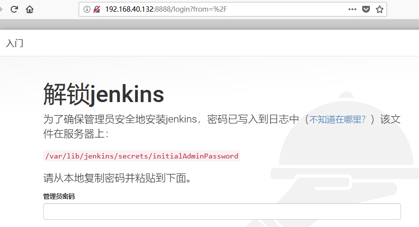
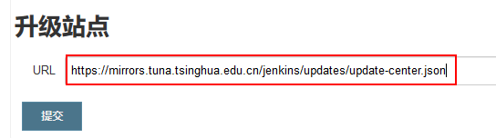

# 微服务容器部署与持续集成

v1.0.30_201905 By BoBo

课程目标：

- 能够完成Gogs （Git私服）的安装与配置，完成代码的提交
- 理解持续集成，说出持续集成的作用
- 能够使用Jenkins完成代码的持续集成(微服务项目的问题、maven私服)


# 4 Gogs-自助Git服务（Git私服）

## 4.1 什么是Gogs

Gogs是一款类似Github(国内有码云)的开源文件/代码管理系统（基于Git），它极易搭建一个自助的Git服务。

Gogs 的目标是打造一个最简单、最快速和最轻松的方式搭建自助 Git 服务。使用 Go 语言开发使得 Gogs 能够通过独立的二进制分发，并且支持 Go 语言支持的 所有平台，包括 Linux、Mac OS X、Windows 以及 ARM 平台。

官网地址：https://gitee.com/Unknown/gogs

**目前功能基本介绍**

- 远程代码仓库管理
- 代码仓库权限分配、管理
- 团队管理
- 代码审查

## 4.2.1 安装

（1）下载镜像

```
docker pull gogs/gogs:0.11.53

```


（2）创建容器

```
docker run -d --name=gogs -p 10022:22 -p 3000:3000 -v /var/gogsdata:/data gogs/gogs:0.11.53
或
docker run -d --name=gogs -p 10022:22 -p 3000:3000 gogs/gogs:0.11.53
```


## 4.2.2 配置

假设我的centos虚拟机IP为192.168.40.134 完成以下步骤

（1）在地址栏输入http://192.168.40.134:3000 会进入首次运行安装程序页面，我们可以选择一种数据库作为gogs数据的存储，最简单的是选择SQLite3。如果对于规模较大的公司，可以选择MySQL。


点击“立即安装”，跳转到登录界面。

【提示】这里的域名要设置为centos的IP地址。


（2）先注册，然后登录：


（4）创建Git仓库（码云中称之为项目）


填写新仓库的内容：


## 4.3 IDEA配置Git

步骤：

（1）在本地安装git(Windows版本)

略

（2）在IDEA中选择菜单 : File -- settings , 在窗口中选择Version Control -- Git


【提示】

1）如果git是用安装版安装的，大多数情况下，idea能自动探测出git命令的位置，可以不配置。


2）Git命令可以选择安装目录的bin下的git.exe，也可以选择安装目录下的cmd下的git.exe。


## 4.4 将十次方代码提交到Git

（1）选择菜单VCS --> Enable Version Control Integration...，弹出的窗口中选择Git


（2）设置远程地址: 右键点击工程选择菜单 Git --> Repository -->Remotes...


（3）右键点击工程选择菜单 Git --> Add

（4）右键点击工程选择菜单 Git --> Commit Directory...


（5）右键点击工程选择菜单 Git --> Repository --> Push ...


【提示】

如果第一次向Gogs提交，可能需要用户名和密码，输入注册的即可。


【补充】

如果密码改了，则需要将之前的凭证删掉，步骤如下（Windows10）：

1）在Windows设置中查询“网络密码”，打开“管理网络密码”：


2）在`凭据管理器`中，找到如下图所在的网络地址，`删除`或`修改`原来的凭证即可。


底层原理：Git自带Git Credential Manager for Windows插件，是 用于 Windows 保存 Git 密码的插件


（6）检验

浏览器打开刷新：`http://192.168.40.128:3000/bobolaoshi/tensquare`，可查看到上传的项目：


# 5 运用Jenkins实现持续集成

## 5.0 理解持续集成

### 5.0.1 什么是持续集成

持续集成 Continuous Integration ，简称CI。

随着软件开发复杂度的不断提高，团队开发成员间如何更好地协同工作以确保软件开发的质量已经慢慢成为开发过程中不可回避的问题。尤其是近些年来，敏捷（Agile）在软件工程领域越来越红火，如何能再不断变化的需求中快速适应和保证软件的质量也显得尤其的重要。

持续集成正是针对这一类问题的一种软件开发实践。它倡导团队开发成员必须经常集成他们的工作，甚至每天都可能发生多次集成。而每次的集成都是通过自动化的构建来验证，包括自动编译、发布和测试，从而尽快地发现集成错误，让团队能够更快的开发内聚的软件。


### 5.0.2 持续集成的特点

- 它是一个自动化的周期性的集成测试过程，从检出代码、编译构建、运行测试、结果记录、测试统计等都是自动完成的，无需人工干预；	
- 需要有专门的集成服务器来执行集成构建；
- 需要有代码托管工具支持，我们下一小节将介绍Git以及可视化界面Gogs的使用。


### 5.0.3 持续集成作用

- 保证团队开发人员提交代码的质量，减轻了软件发布时的压力；
- 持续集成中的任何一个环节都是自动完成的，无需太多的人工干预，有利于减少重复过程以节省时间、费用和工作量；


## 5.1 Jenkins简介

 Jenkins是一个开源软件项目，是基于Java开发的一种持续集成工具，用于监控持续重复的工作，旨在提供一个开放易用的软件平台，使软件的持续集成变成可能。

Jenkins，原名Hudson，2011年改为现在的名字，它 是一个开源的实现持续集成的软件工具。

官方网站：`https://jenkins.io/`。


 Jenkins 能实施监控集成中存在的错误，提供详细的日志文件和提醒功能，还能用图表的形式形象地展示项目构建的趋势和稳定性。
 特点：

- 易安装：仅仅一个 java -jar jenkins.war，从官网下载该文件后，直接运行，无需额外的安装，更无需安装数据库；
- 易配置：提供友好的GUI配置界面；
- 变更支持：Jenkins能从代码仓库（Subversion/CVS）中获取并产生代码更新列表并输出到编译输出信息中；
- 支持永久链接：用户是通过web来访问Jenkins的，而这些web页面的链接地址都是永久链接地址，因此，你可以在各种文档中直接使用该链接；
- 集成E-Mail/RSS/IM：当完成一次集成时，可通过这些工具实时告诉你集成结果（据我所知，构建一次集成需要花费一定时间，有了这个功能，你就可以在等待结果过程中，干别的事情）；
- JUnit/TestNG测试报告：也就是用以图表等形式提供详细的测试报表功能；
- 支持分布式构建：Jenkins可以把集成构建等工作分发到多台计算机中完成；
- 文件指纹信息：Jenkins会保存哪次集成构建产生了哪些jars文件，哪一次集成构建使用了哪个版本的jars文件等构建记录；
- 支持第三方插件：使得 Jenkins 变得越来越强大


## 5.2 Jenkins安装

本文是Linux下的安装。

### 5.2.1 JDK安装(此步略)

（1）将jdk-8u171-linux-x64.rpm上传至服务器（虚拟机）

（2）执行安装命令

```
rpm -ivh jdk-8u181-linux-x64.rpm
```

RPM方式安装JDK，其根目录为：/usr/java/jdk1.8.0_181-amd64

安装完成后，使用`java -version` 或`which java`或`whereis java`测试一下

【提示】

如果有其他内置的jdk，请先都卸载掉。

【扩展补充】

可以在线自动安装

```
yum install -y java
```

默认位置：

/usr/java/jdk1.8.0_181-amd64


### 5.2.2 Jenkins的Linux下安装与启动

（1）下载jenkins

```
wget https://pkg.jenkins.io/redhat-stable/jenkins-2.121.3-1.1.noarch.rpm
```

官网的centos环境下的版本的下载直达地址：

https://pkg.jenkins.io/redhat-stable/

（2）安装jenkins

```
rpm -ivh jenkins-2.121.3-1.1.noarch.rpm
```

运行结果：

```
[root@pinyoyougou-docker ~]# rpm -ivh jenkins-2.121.3-1.1.noarch.rpm 
警告：jenkins-2.121.3-1.1.noarch.rpm: 头V4 DSA/SHA1 Signature, 密钥 ID d50582e6: NOKEY
准备中...                          ################################# [100%]
正在升级/安装...
   1:jenkins-2.121.3-1.1              ################################# [100%]
```


（3）配置jenkins

```
vi /etc/sysconfig/jenkins
或
vim /etc/sysconfig/jenkins
```


修改用户和端口

```
JENKINS_USER="root"
JENKINS_PORT="8888"
```


修改升级国内镜像站点：（可选）

修改`/var/lib/jenkins/hudson.model.UpdateCenter.xml`，

将文件中的默认的`https://updates.jenkins.io/update-center.json`修改为

```
https://mirrors.tuna.tsinghua.edu.cn/jenkins/updates/update-center.json
或
https://mirrors.shu.edu.cn/jenkins/updates/update-center.json
或
http://mirror.xmission.com/jenkins/updates/update-center.json
或
http://mirror.esuni.jp/jenkins/updates/update-center.json

```

镜像地址查询：

http://mirrors.jenkins-ci.org/status.html


（4）启动服务

```
systemctl start jenkins
systemctl status jenkins
```


（5）访问链接 http://192.168.40.128:8888

如果不能访问到页面，请关闭centos7的防火墙，

```
systemctl stop firewalld
systemctl disable firewalld
```



【了解】关闭防火墙的常用操作参考如下

```
启动： systemctl start firewalld
关闭： systemctl stop firewalld
查看状态： systemctl status firewalld 
开机禁用  ： systemctl disable firewalld
开机启用  ： systemctl enable firewalld
```


根据页面的提示，从`/var/lib/jenkins/secrets/initialAdminPassword`中获取初始密码串，粘贴到管理员密码处，点击继续。


（6）安装插件


这里选择“安装推荐的插件”，然后系统自动开始安装常用的推荐的插件：


（如果失败，重试链接：http://192.168.40.134:8888/restart）

如果报错：An error occurred
An error occurred during installation: No such plugin: cloudbees-folder

需要在网上下载：http://ftp.icm.edu.pl/packages/jenkins/plugins/cloudbees-folder/
下载cloudbees-folder.hpi放在目录/var/lib/jenkins/plugins下，重启Jenkins即可。如果还是报错，可能是jdk、tomcat、jenkins版本不兼容，要从新安装兼容的版本。


（7）新建用户

这里设置用户名itcast，密码123456.


最后确认，点击保存并完成


完成安装进入主界面


## 5.3 Jenkins插件安装

在Jenkin是第一次配置中，默认安装的插件可能还不够，需要安装更多的插件，比如Maven的，就需要自定义安装插件了。

### 5.3.1 安装整合Maven插件

（1）点击左侧的`系统管理`菜单 ,然后点击`管理插件`


（2）选择“可选插件”选项卡，搜索maven，在列表中选择Maven Integration ，点击“直接安装”按钮


看到如下图时，表示已经完成


### 5.3.2 安装Git插件

步骤如上图，搜索`git plugin`，进行安装：


【提示】

当前版本的Git在第一次启动配置的时候已经默认安装了，这里无需安装。


【扩展】

如果插件下载非常慢，可以配置国内的镜像，比如清华的镜像源：

```
https://mirrors.tuna.tsinghua.edu.cn/jenkins/updates/update-center.json
```

更换地址方法：

1.进入jenkins`系统管理 `

2.进入`插件管理 `

3.点击`高级`，修改升级站点的地址为清华大学镜像地址 



原地址：

```
https://updates.jenkins.io/update-center.json
```


## 5.4 全局工具配置

### 5.4.1 安装Maven与本地仓库

目标：在安装有Jenkins的系统中安装Maven

（1）将Maven压缩包上传至服务器（虚拟机）

（2）解压

```
tar zxvf apache-maven-3.5.4-bin.tar.gz
```

（3）移动目录

```
mv apache-maven-3.5.4 /usr/local/maven
```

（4）编辑setting.xml配置文件

```
vi /usr/local/maven/conf/settings.xml
或
vim /usr/local/maven/conf/settings.xml
```

配置本地仓库目录,内容如下

```xml
<localRepository>/usr/local/repository</localRepository>
```

阿里云的私服也顺便配置一下：

```xml
    <mirror>    
        <id>repository-aliyun</id>    
        <mirrorOf>*</mirrorOf>    
        <name>Nexus aliyun</name>    
        <url>https://maven.aliyun.com/repository/public</url>    
    </mirror>  
```


（5）将开发环境的本地仓库上传至服务器（虚拟机）并移动到/usr/local/repository 。

```
mv reponsitory_boot /usr/local/repository
```

执行此步是为了以后在打包的时候不必重新下载，缩短打包的时间。


（6）如果有不是maven官方的插件，在项目中不声明就要直接使用，则需要编辑setting.xml配置文件，添加插件的groupid；如果项目中已经声明了，则无需配置。

```
<pluginGroups>    
	<pluginGroup>com.spotify</pluginGroup>    
</pluginGroups>
```

配置环境变量

```
#打开环境配置文件
vi /etc/profile
#在适当的位置添加
export M2_HOME=/usr/local/maven
export PATH=$PATH:$M2_HOME/bin
#export PATH=$PATH:$JAVA_HOME/bin:$M2_HOME/bin
#环境变量生效：
source /etc/profile
```

测试：

```
mvn -v
```


### 5.4.2 安装Git

提示：已经安装好了，不用安装了。

参考步骤：

（1）安装依赖环境并移除系统中的git

```
yum install curl-devel expat-devel gettext-devel openssl-devel zlib-devel
yum install gcc perl-ExtUtils-MakeMaker
yum remove git
```

（2） 获取程序包

```
#程序包存放在”/usr/local”
wget https://www.kernel.org/pub/software/scm/git/git-2.9.5.tar.gz
```

（3） 解压并编译安装

```
cd /usr/local
#解压
tar -zxvf git-2.9.5.tar.gz
#编译安装
cd git-2.9.5
make prefix=/usr/local/git all
make prefix=/usr/local/git install
#添加环境变量，并使其生效
echo "export PATH=$PATH:/usr/local/git/bin" >> /etc/bashrc
source /etc/bashrc
```


### 5.4.2 全局工具配置

选择`系统管理`-`全局工具配置`

（1）JDK配置


设置javahome，如 /usr/java/jdk1.8.0_181-amd64

（2）Git配置 （本地已经安装了Git软件）


提示：如果没有配置全局环境变量，要带上路径。

（3）Maven配置：/usr/local/maven


## 5.5 第一个持续集成任务-Eureka微服务

需求目标：对Eureka微服务制作一个自动发布任务。

### 准备工作

修改Eureka项目的IP地址，从localhost，改为192.168.40.128,并提交到git上

```
...
eureka:
  instance:
    #注册中心服务的主机，默认是localhost
    hostname: 192.168.40.128
...
  client:
...  
    service-url:
      #默认http://localhost:8761/eureka/
      defaultZone: http://${eureka.instance.hostname}:${server.port}/eureka/
```

另外，需要保证有配置`docker-maven-plugin`插件。

最重要的一点，要将Eureka微服务项目要push到Gogs的git上。


### 5.5.1 创建任务

（1）回到首页，点击菜单`新建任务`，


输入任务名称（名字随意），选择`构建一个Maven项目`，点击`确定`


（2）`General`一般信息填写


（3）源码管理，选择`Git`，并输入Git远程仓库地址，这里我们粘贴Gogs中的项目git地址：


Repository URL：Git仓库地址

Credentials：凭证，如果Git仓库是私有的，则需要添加用户名密码，如果是共有的，则无需添加。

Branch Specifier (blank for 'any')：指定的分支，也就是说拉取哪个分支的代码，也是后续构建代码库的根目录，默认是`*/master`。


（4）Build构建信息：


输入的内容参考：

```
tensquare_eureka/pom.xml
#用于清除、打包，构建docker镜像
clean package -Dmaven.test.skip=true docker:build -DpushImage
```

（5）最后点击“保存”按钮。


### 5.5.2 执行任务

（1）点击左上角的`返回首页`或者重新打开主页，在列表中找到我们刚才创建的任务，点击右边的绿色箭头按钮，即可执行此任务.


失败的效果：


（2）在左下角`构建执行状态`，可以查看任务执行的情况，点击正在执行的任务，


然后点击左边菜单`控制台输出`，可以看到实时输出的日志


这就是镜像做好了在上传，如果你之前没有将你的本地仓库上传到服务器，会首先下载依赖的jar包，接下来就是漫长的等待了。

看到下面的结果就表示你已经成功了


【错误提示】

如果出现如下错误，一般是由于docker不允许远程执行命令，需要开启，开启方法参照2.4小节：

```
[ERROR] Failed to execute goal com.spotify:docker-maven-plugin:1.1.1:build (default-cli) on project tensquare_eureka: 
......
Connect to 192.168.40.128:2375 [/192.168.40.128] failed: 拒绝连接 (Connection refused) -> [Help 1]
```


首战告捷！哈哈，兴奋不？返回首页 看到列表


提示：如果有失败记录，则根据比例，会显示为白云图案，如果全部成功，则是太阳图案，如果失败，则是雷电图案。


检验：

1）看docker镜像的更新时间：


2）我们在浏览器看一下docker私有仓库

http://192.168.184.135:5000/v2/_catalog ,会看到tensquare_eureka已经上传成功了：

```
{"repositories":["centos-jdk8","tensquare_eureka"]}
```

3）删除镜像，并依据私服重新创建容器：

```
docker rmi 192.168.40.128:5000/tensquare_eureka:1.0-SNAPSHOT
docker run -d --name=tensquare_eureka -p 8761:8761 192.168.40.128:5000/tensquare_eureka:1.0-SNAPSHOT
```


【扩展】自动创建容器

可以手动写后置shell脚本，在执行成功后，执行删除就容器和创建新容器的动作：


参考内容：

```shel
docker rm -f tensquare_eureka;
docker run -id --name tensquare_eureka -p 8761:8761 192.168.40.136:5000/tensquare_eureka:1.0-SNAPSHOT
```


## 5.6 其他微服务的持续集成构建

### 5.6.1 配置中心微服务的持续集成

项目整体修改

（1）在项目中pom.xml中，添加docker插件

```xml

    <build>
        <!--打包后的项目的文件名称-->
        <finalName>app</finalName>
        <!--<finalName>${project.artifactId}</finalName>-->
        <plugins>
            <plugin>
                <groupId>org.springframework.boot</groupId>
                <artifactId>spring-boot-maven-plugin</artifactId>
            </plugin>
            <!-- docker的maven插件，官网：https://github.com/spotify/docker-maven-plugin -->
            <plugin>
                <groupId>com.spotify</groupId>
                <artifactId>docker-maven-plugin</artifactId>
                <version>1.1.1</version>
                <configuration>
                    <!--生成的镜像名字-->
                    <imageName>192.168.40.128:5000/${project.artifactId}:${project.version}</imageName>
                    <!--基础镜像名称，相当于dockerfile中的FROM centos-jdk8 -->
                    <baseImage>192.168.40.128:5000/centos-jdk8</baseImage>
                    <!--入口点-->
                    <entryPoint>["java", "-jar", "/${project.build.finalName}.jar"]</entryPoint>
                    <!-- copy the service's jar file from target into the root directory of the image
                    要将生成的微服务的jar资源拷贝到哪里，这里配置的是容器的根目录下面，相当于ADD /app.jar /-->
                    <resources>
                        <resource>
                            <targetPath>/</targetPath>
                            <directory>${project.build.directory}</directory>
                            <include>${project.build.finalName}.jar</include>
                        </resource>
                    </resources>
                    <!--设置docker的服务地址，默认连接的docker主机为localhost:2375-->
                    <dockerHost>http://192.168.40.128:2375</dockerHost>
                </configuration>
            </plugin>
        </plugins>
    </build>
```


修改Eureka地址为部署后的注册中心地址：

```yaml
eureka:
  client:
    #Eureka服务的地址
    service-url:
      defaultZone: http://192.168.40.134:8761/eureka/
```

（2）提交代码到git

（4）创建rabbitMQ容器（如果已经构建了，需要启动即可）

```
docker run -di --name=tensquare_rabbitmq -p 5671:5617 -p 5672:5672 -p 4369:4369 -p 15671:15671 -p 15672:15672 -p 25672:25672 rabbitmq:management

```

（3）按照同样的方法，完成配置中心的持续集成，相关信息参考如下：

```
tensquare_config
十次方配置中心微服务
http://192.168.40.128:3000/bobolaoshi/tensquare.git
tensquare_config/pom.xml
clean package -Dmaven.test.skip=true docker:build -DpushImage
```


完成后会看到私有仓库中添加了tensquare_config

```
{"repositories":["centos-jdk8","tensquare_config","tensquare_eureka"]}
```


（5）创建容器：

```
docker run -di --name=config -p 12000:12000 192.168.40.128:5000/tensquare_config:1.0-SNAPSHOT
```

（6）检验

浏览器访问：http://192.168.40.128:12000/base-dev.yml 看是否能抓取数据过来。


### 5.6.2 通用项目的持久集成

目标：就是将通用项目安装到maven仓库。


在pom.xml中添加配置，用来禁用父项目中的springboot的打包插件：

```xml
<build>
        <plugins>
            <plugin>
                <groupId>org.springframework.boot</groupId>
                <artifactId>spring-boot-maven-plugin</artifactId>
                <configuration>
                    <skip>true</skip>
                </configuration>
                <executions>
                    <execution>
                        <id>default-jar</id>
                        <phase>none</phase>
                    </execution>
                </executions>
            </plugin>
        </plugins>
    </build>
```

要提交到git！


采用复制任务的方式创建。

```
tensquare_common
十次方配置通用工程
http://192.168.40.128:3000/bobolaoshi/tensquare.git
tensquare_common/pom.xml
clean install -Dmaven.test.skip=true
```


### 5.6.2 父项目的持久集成-安装

注意：

直接在git中修改父项目的pom文件，去掉模块依赖：


Jenkins任务参考common的安装。


### 5.6.3 基础微服务的持续集成

采用复制任务的方式创建。

（1）pom代码中添加docker插件 ,并且更改配置文件（在码云上）中的配置中心的地址为http://192.168.40.128:12000

（2）提交代码到git

（4）准备数据库环境（如果已经有了，就启动即可）

```
docker run -di --name=mysql -p 3306:3306 -e MYSQL_ROOT_PASSWORD=123456 centos/mysql-57-centos7

```

（3）按照同样的方式构建基础微服务


（5）创建基础微服务容器

```
docker run -d -p 9001:9001 --name=tensqare_base 192.168.40.128:5000/tensquare_base:1.0-SNAPSHOT
```


【重要提示】

如果使用配置中心，Eureka的客户端的配置也需要配置到boostrap.yml中，否则无法在注册中心发现其他微服务。

bootstrap.yml

```yaml
spring:
  cloud:
    config:
      #应用的名字
      name: base
      #环境标识
      profile: dev
      #分支的名字
      label: master
      #配置中心的地址
      #uri: http://localhost:12000
      discovery:
        #开启Eureka的注册的服务的发现
        enabled: true
        #在Eureka中注册的配置中心服务端的名字
        service-id: tensquare-config
eureka:
  client:
    #Eureka服务的地址
    service-url:
      defaultZone: http://192.168.40.136:8761/eureka/
  instance:
    #用于表示在猜测主机名时，服务器的IP地址应该与操作系统报告的主机名相对应。(注册服务和客户端如果在一台机器上则无需配置)
    prefer-ip-address: true
    #租期更新时间间隔（默认30秒）
    leaseRenewalIntervalInSeconds: 10
    #租期到期时间（默认90秒）
    leaseExpirationDurationInSeconds: 30
```


### 5.6.4 完成微服务网关的构建

按照同样的步骤完成微服务网关tensquare_web的构建


### 5.6.5 其它微服务的构建

按照同样的步骤完成两个微服务网关以及其他业务微服务的构建

学员实现


# 总结

## 课程总结

## 面试问题

1）会不会搭建git私服

Gogs

2）什么是持续继承

为了提高代码质量，不断、经常的集成项目，进行测试，这个过程就是持续集成。

3）用过持续集成吗

使用Jenkins。

只需要前期进行相关配置（软件安装+插件安装等）---》进行任务配置---》执行任务即可。

以后：提交代码到git---》执行任务

