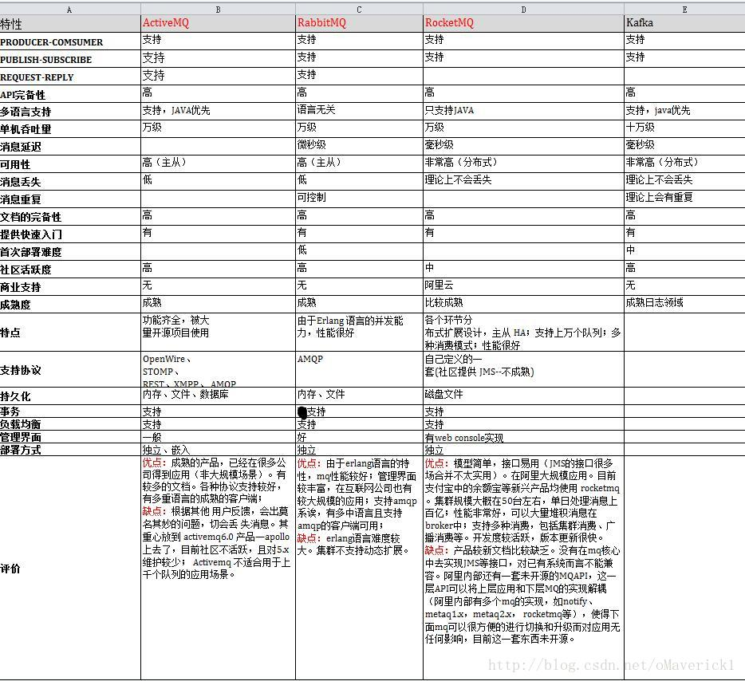
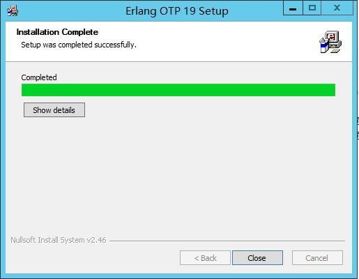
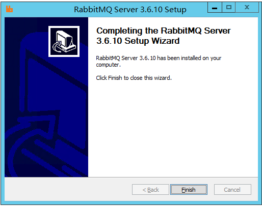
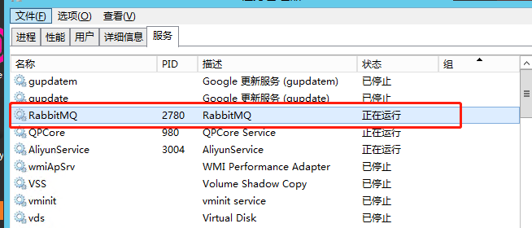
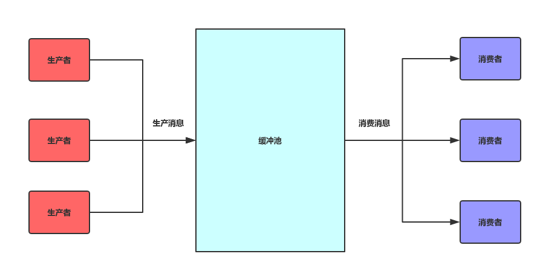
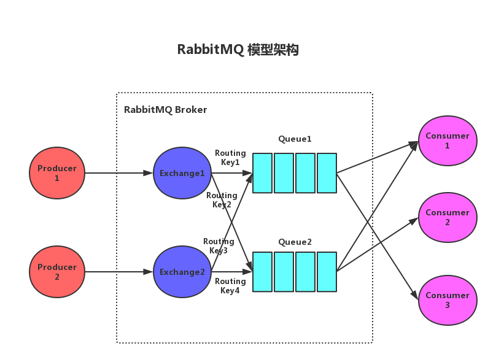
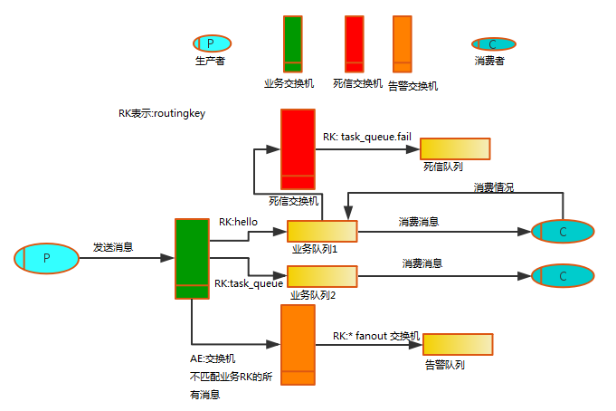

# Rabbit Mq

## 一. rabbit mq是消息队列及其作用

### A. Mq的分支

​	**AMQP**:   应用层标准高级消息队列协议，不受客户端/中间件不同产品，不同的语言的开发语言等条件设计。
​        RabbitMQ：erlang开发，稳定性好；Kafka：分布式消息系统，高吞吐量。

​    **JMS**:    Java MessageService指JMS API，为Java提供统一的消息操作。
​        ActiveMQ：apache；RocketMQ：阿里巴巴，交由apache基金会。

**两者间的区别和联系**：

​		JMS是定义了统一的接口，来对消息操作进行统一；AMQP是通过规定协议来统一数据交互的格式

​		JMS限定了必须使用Java语言；AMQP只是协议，不规定实现方式，因此是跨语言的。

​		JMS规定了两种消息模型；而AMQP的消息模型更加丰富

### B. Mq的优点

**消息队列模型**："消息生产者" ➡️ "消息队列" ➡️ "消息消费者"；生产者向消息队列中生产消息，消费者从消息队列中获取消息。

**消息队列有点**：消息的生产和消费在逻辑运行上是不相干的，生产者只管生产消息，而消费者只管持续监听消息，二者是异步的，期间没有业务逻辑的侵入，这样就实现了生产者和消费者的解耦。

### C. 四种MQ之间对比图

## 二. rabbit mq的安装和下载(win、mac)

​	rabbitmq就是一款实现消息队列的中间件，需要下载使用。

### window端下载

**Erlang下载**：首先rabbitmq是基于erlang语言的，需要先安装Erlang语言。

​	Erlang官网地址：https://www.erlang.org/downloads

​	快捷下载地址：(19.3版本)http://erlang.org/download/otp_win64_19.3.exe

**Erlang安装**：安装过程简单粗暴，以管理员身份运行，然后一直next即可。



**RabbitMq下载**：

​	官网下载地址：http://www.rabbitmq.com/download.html

​	快捷下载地址：(3.7.7版本)

​		Github仓库：https://github.com/rabbitmq/rabbitmq-server/releases/download/v3.7.7/rabbitmq-server-3.7.7.exe 

​		Bintray仓库：https://dl.bintray.com/rabbitmq/all/rabbitmq-server/3.7.7/rabbitmq-server-3.7.7.exe

**RabbitMq安装**：



安装完成后显示服务已经启动：



**配置RabbitMQ**：

启动 rabbitmq_management

在命令行CMD中，进入rabbitmq安装目录的sbin

```
C:\Program Files (x86)\RabbitMQ Server\rabbitmq_server-3.6.10\sbin
```

执行以下命令：

```
rabbitmq-plugins enable rabbitmq_management
```

然后打开浏览器，输入`localhost:15672`

到此，rabbitmq_management管理界面启动就完毕了，通过该管理界面，可以管理rabbitmq的队列，虚拟机，交换器等。

默认账户：`guest`
默认密码：`guest`


### mac端下载

**brew的安装**：

终端输入：

/usr/bin/ruby -e "$(curl -fsSL https://raw.githubusercontent.com/Homebrew/install/master/install)"

**Erlang下载安装：**

```
	brew install erlang
```

**rabbitmq下载安装**：

```
	// 更新brew资源
  brew update
  // 执行安装
  brew install rabbitmq
```

**注**：过程中可能会需要确认管理员密码。

​		安装RabiitMQ的可视化监控插件

- ```
  	// 切换到MQ目录,注意你的安装版本可能不是3.7.4
    cd /usr/local/Cellar/rabbitmq/3.7.4/
    // 启用rabbitmq management插件
    sudo sbin/rabbitmq-plugins enable rabbitmq_management
  ```

  配置环境变量

  ```
  	sudo vi /etc/profile
   // 加入以下两行
   export RABBIT_HOME=/usr/local/Cellar/rabbitmq/3.7.4
   export PATH=$PATH:$RABBIT_HOME/sbin
   // 立即生效
   source /etc/profile
  ```

  后台启动rabbitMQ

  ```
  	// 后台启动
    rabbitmq-server -detached  
    // 查看状态
    rabbitmqctl status 
    // 浏览器内输入 http://localhost:15672,默认的用户名密码都是guest
    rabbitmqctl stop 关闭
  ```


## 三. MQ的5种消息模型

### 	A. 简单队列

这种队列，纯属RabbitMQ搞的一个花样，仅仅是个概念而已！并不是实际的队列类型！他就是在假设某个队列只有一个消费者，也就是说，读者在实际使用中，某个队列傻傻的只用一个消费者去消费，这就叫simple简单队列啦，应用场景极少，一般情况下消费端都会有多个消费者。

### 	B. 争抢模式

消费者消费消息的多少，完全取决于消费者的处理能力，能者多劳，相当于消费者主动从mq中取消息，而不是被mq安排消息。

### 	C. 轮询模式

利用了自动通知参数，开启了自动通知，mq根据一个简单的规则(比如取模运算)，先确定好哪些消息发送给哪些消费者，无论消费者处理能力如何，这些消息都得让你处理，因此每个消费者最终处理的消息数量，是相同的(忽略"消息数量/消费者"不能整除的情况)。

​     这种模式很明显是有问题的，首先，这种模式不能很好的利用消费端的性能差异，做不到真正意义上的负载均衡，浪费资源；其次，这种模型还有可能造成大量消息堆积在消费者容器中，这是非常危险的，不仅会造成消息丢失，还有可能压垮消费者。

### 	D.发布订阅

交换机的概念非常简单，就是一个转发器，有了交换机之后，生产端先把消息发送到交换机，然后交换机再把消息发送到与其绑定的消息队列，这样就解决了生成端如何把一条消息批量发送到多个消息队列的问题。

​     交换机本身没有数据存储能力，仅仅是一个代理，可以理解成nginx。

### 	E. 路由模式

路由模式仅仅基于发布订阅搞了一点小事情，在发布订阅模式中，交换机无脑向所有与之绑定的消息队列发送消息，而路由模式对交换机做了一些限制，它指定了一个route key，生产端向交换机发送消息时，指定消息的route key，消费端将消息队列绑定到交换机时，也指定该队列消费的route key，这样一来，交换机就可以根据消息的route key，将该消息转发到绑定(消费)该route key的消息队列。

### 	F. 主题模式：(topic)通配符

主题模式和路由模式完全一样，只不过是消费端route key不用写死，route key支持通配符，增加了一个模糊匹配的功能，这样在某些场景下，消费端就不用逐一绑定所有监听的route key，直接用抽象的通配符表示即可，当然，这是针对消费端的优化，与生产端无关。

## 四. 与spring的封装-springAMQP

### A. 运行机制流程图





### B. mq的运行机制

1. 生产者将消息发送至消息队列中。
2. 消费者不断监听消息队列，获取到队列中的消息。

### C. springboot自动配置

基本连接配置：

```
	spring.rabbitmq.host=127.0.0.1
	spring.rabbitmq.port=5672
	spring.rabbitmq.username=admin
	spring.rabbitmq.password=admin
	spring.rabbitmq.publisher-confirms=true
	spring.rabbitmq.virtual-host=/
```

​	

### D. 简单队列实现

```java
@Controller
public class Send {
    @Autowired
    private AmqpTemplate amqpTemplate;

    @RequestMapping("/send")
    @ResponseBody
    public void send(){
    		//生产者将消息发送至simple_queue队列
        amqpTemplate.convertAndSend("simple_queue","hello mq");
    }
}
```

```java
@Component
public class Listener {
  	//消费者监听simple_queue队列中消息
    @RabbitListener(queuesToDeclare = @Queue("simple_queue"))
    public void listener(String msg){
        System.out.println(msg);
    }
}
```

## 五. MQ深入问题

### A. 消息的消费失败与重试

顾虑到消费重试失败的情况，加入死信队列。即在正常业务队列执行失败后进入的队列。

#### a. 运行机制流程图



#### b. 死信队列运行流程

1. 首先生产者生产消息发送至业务交换机-(business-exchange)
2. 业务交换机匹配相应的业务队列-(business-queue)
3. 消息通过队列发送给消费者进行消费。

4. 在消费过程中出现消费失败的情况导致消费端重试，设置的次数为3次，间隔3秒。

5. 消费者重试消费3次后依然失败，预把消息发送至死信队列中。

6. 首先消息通过业务队列中绑定的死信交换机- (dead.letter.exchange)和Key- (dead.letter.routing.key)匹配相应的死信队列- (dead-letter-queue)，消息被发送至死信队列中。

7. 消息最终在死信队列中进行日志记录或者储存至数据库内设置定时任务进行后续重试。

#### c. 升级配置

```java
	//最大重试次数
	spring.rabbitmq.listener.simple.retry.max-attempts=3
	//是否开启消费端重试
	spring.rabbitmq.listener.simple.retry.enabled=true
  //重试时间间隔
	spring.rabbitmq.listener.simple.retry.initial-interval=3000
	//ack机制的自动控制
	spring.rabbitmq.listener.simple.acknowledge-mode=auto
	//最终消费失败信息的是否丢弃
	spring.rabbitmq.listener.simple.default-requeue-rejected=false
```

#### d. 死信队列的实现

```java
@Component
public class DirectRabbitConfig {
    public static final String BUSINESS_QUEUE = "business-queue";
    public static final String BUSINESS_EXCHANGE = "business-exchange";
    public static final String DEAD_LETTER_QUEUE = "dead-letter-queue";
    public static final String DEAD_LETTER_EXCHANGE = "dead.letter.exchange";
    public static final String DEAD_LETTER_QUEUE_ROUTING_KEY = "dead.letter.routing.key";
    
    // 声明业务Exchange
    @Bean("businessExchange")
    public FanoutExchange businessExchange(){
        return new FanoutExchange(BUSINESS_EXCHANGE);
    }

    // 声明死信Exchange
    @Bean("deadLetterExchange")
    public DirectExchange deadLetterExchange(){
        return new DirectExchange(DEAD_LETTER_EXCHANGE);
    }

    // 声明业务队列A
    @Bean("businessQueue")
    public Queue businessQueue(){
        Map<String, Object> args = new HashMap<>(2);
				// 声明当前队列绑定的死信交换机
        args.put("x-dead-letter-exchange", DEAD_LETTER_EXCHANGE);
				// 声明当前队列的死信路由key
        args.put("x-dead-letter-routing-key", DEAD_LETTER_QUEUE_ROUTING_KEY);
        return QueueBuilder.durable(BUSINESS_QUEUE).withArguments(args).build();
    }

    // 声明死信队列
    @Bean("deadLetterQueue")
    public Queue deadLetterQueue(){
        return new Queue(DEAD_LETTER_QUEUE);
    }

    // 声明业务队列绑定关系
    @Bean
    public Binding businessBinding(@Qualifier("businessQueue") Queue queue,
    									@Qualifier("businessExchange") FanoutExchange exchange){
        return BindingBuilder.bind(queue).to(exchange);
    }

    // 声明死信队列绑定关系
    @Bean
    public Binding deadLetterBinding(@Qualifier("deadLetterQueue") Queue queue,
                       @Qualifier("deadLetterExchange") DirectExchange exchange){
        return BindingBuilder.bind(queue).to(exchange).with(DEAD_LETTER_QUEUE_ROUTING_KEY);
    }
}
```

```java
@Controller
public class Send {
    @Autowired
    private RabbitTemplate rabbitTemplate;

    @RequestMapping("send")
    public void send(){
        //生产者通过BUSINESS_EXCHANGE交换机将消息发送至队列
        rabbitTemplate.convertSendAndReceive(BUSINESS_EXCHANGE,"","hello mq");
    }
}
```

```java
@Slf4j
@Component
public class Listener {
		//正常业务队列
    @RabbitListener(queues = BUSINESS_QUEUE)
    public void receiveA(Message message, Channel channel) throws IOException {
        System.out.println("运行了");
      	//蓄意抛出错误，使其重试
        int i = 1/0;
      
        String msg = new String(message.getBody());
        log.info("收到业务消息：{}", msg);
        boolean ack = true;
        Exception exception = null;
        try {
            if (msg.contains("deadletter")){
                throw new RuntimeException("dead letter exception");
            }
        } catch (Exception e){
            ack = false;
            exception = e;
        }
        if (!ack){
            log.error("消息消费发生异常，error msg:{}", exception.getMessage(), exception);
            channel.basicNack(message.getMessageProperties().getDeliveryTag(), false, false);
        } else {
            channel.basicAck(message.getMessageProperties().getDeliveryTag(), false);
        }
    }
}
```

```java
@Component
public class DeadLetter {
		//死信队列
    @RabbitListener(queues = DEAD_LETTER_QUEUE)
    public void receiveA(Message message, Channel channel) throws IOException {
        System.out.println("收到死信消息：" + new String(message.getBody()));
        channel.basicAck(message.getMessageProperties().getDeliveryTag(), false);
    }
}
```

**注：DEAD_LETTER_EXCHANGE(死信交换机) 和 DEAD_LETTER_QUEUE_ROUTING_KEY(死信路由Key)不能乱用连接符号，如若需要，请用 "." 连接。**


### B. 消息的重复消费

**增加消息状态表**：

用来记录消息的处理状态，每次处理消息之前，都去 状态表中查询一次，如果已经有相同的消息存在，那么不处理，可以防止重复发送。 

**保证接口幂等即可**：

某些接口原本就是幂等的，不幂等的接口需要增加具体的业务状态来确定，在消费端通过业务判断是否执行过。

### C. 消息的丢失处理

​	1.消费者的ACK机制。可以防止消费者丢失消息。
​	2.消息持久化：前提是队列，交换机都持久化
​	3.生产者确认：生产者发送消息后，等待mq的ack回执，如果没有收到或者收到失败信息，则重试，收到则结束业务

​	b. 可以发送消息前，将消息持久化到数据库，并记录消息状态，后续消息发送，消费等过程都依赖于数据库中消息状态的判断和修改。	

### D. 消息的有序化

​        **1.业务同时对并发要求不高：**
​            1.保证消息发送时有序同步发送
​            2.保证消息发送被同一个队列接收
​            3.保证一个队列只有一个消费者
​        **2.业务同时对并发要求较高：**
​            1.保证消息发送时有序同步发送
​            2.可以有多个队列
​            3.有序列要求的一组消息，通过hash方式分派到一个固定队列

### 5.消息堆积

​    通过同一个队列多消费者监听，实现消息的争抢，加快消息消费速度。


## 六. RabbitMq在本次业务中的作用

**1.mq在业务中解决的问题**

mq在本次业务中，通过异步传输消息的方式，解决了业务中请求过量而影响整体服务器的运行效果问题。（在Contorller层接收请求并发送消息至队列中，等待消费端的消费）

**2.mq消费端失败后的解决方案**

在消息发送至队列后，消费端开始进行消费，但由于消费端运行业务时产生了预计之外的错误使得消息消费失败，此时mq自身有消息的重试功能，默认的消息重试是无限的，这并不符合业务的需求。

**3.失败后重试次数、时长、是否丢弃失败消息、手自动控制等。**

利用springboot的自动配置，在配置文件中设置了：是否开启消费者重试、

最大重试次数、重试时间间隔、消息是否丢弃、ack返回手自动控制等。

**4.最终失败的消息发送至死信队列的记录**

如果失败的消息重试后最终依然失败，采取死信队列的方式。在创建业务队列的同时创建死信队列并且进行绑定，最终失败消息会发送至死信队列并进行日志记录或者储存至数据库内设置定时任务进行后续重试。

**5.失败消息在重试消费过程中总是优先在队列第一位，对其进行的优化 (预留问题)**

失败消息在设置最大限制内的进行重试时，失败的信息总是优先排列在队列的最前端，不符合消息的排列顺序和业务的理想状态。

​	问题1: 如何将失败消息后置到队列后方，进行有序的排列。

​	问题2: 失败消息与重试时间的控制。

​	问题3: 后续如何判断消息的重试次数。

  

等... ...
    


