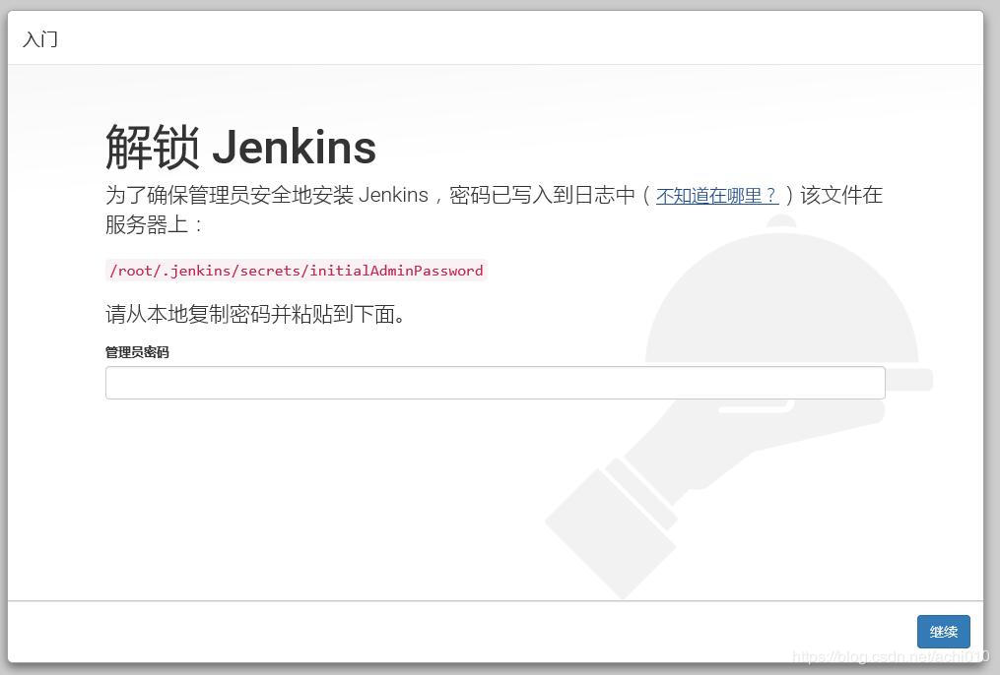
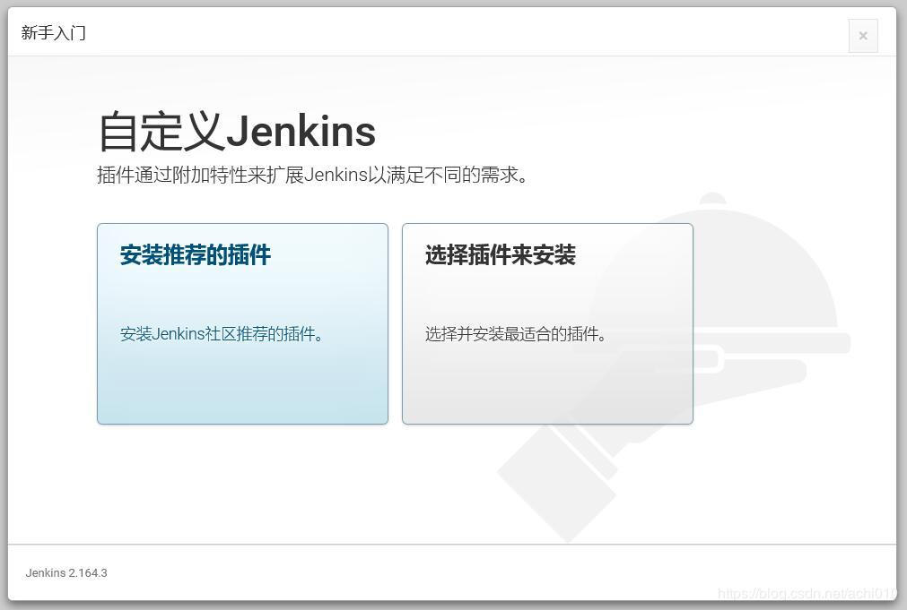
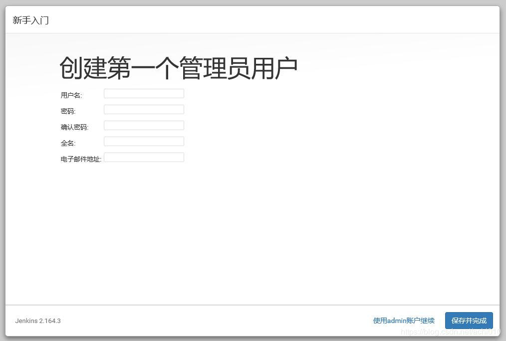
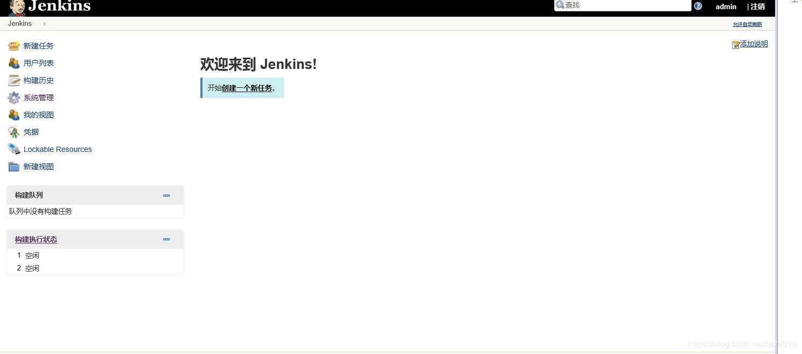

# jenkins

## 一、jenkins的历史和介绍


Jenkins的前身是Hudson，采用JAVA编写的持续集成开源工具。Hudson由Sun公司在2004年启动，第一个版本于2005年在java.net发布。2007年开始Hudson逐渐取代CruiseControl和其他的开源构建工具的江湖地位。在2008年的JavaOne大会上在开发者解决方案中获得杜克选择大奖（Duke's Choice Award）。

在2010年11月期间，因为Oracle对Sun的收购带来了Hudson的所有权问题。主要的项目贡献者和Oracle之间，尽管达成了很多协议，但有个关键问题就是商标名称“Hudson”。甲骨文在2010年12月声明拥有该名称并申请商标的权利。 因此，2011年1月11日，有人要求投票将项目名称从“Hudson”改为“Jenkins”。2011年1月29日，该建议得到社区投票的批准，创建了Jenkins项目。

2011年2月1日，甲骨文表示，他们打算继续开发Hudson，并认为Jenkins只是一个分支，而不是重命名。因此，Jenkins和Hudson继续作为两个独立的项目，每个都认为对方是自己的分支。到2013年12月，GitHub上的Jenkins拥有567个项目成员和约1,100个公共仓库，与此相对的Hudson有32个项目成员和17个公共仓库。到现在两者的差异更多，应该说Jenkins已经全面超越了Hudson。此外，大家可能是出于讨厌Oracle的情绪，作为Java开发者天然地应该支持和使用Jenkins。

从上面两个项目的logo，大家也可以看到两个项目之间的亲戚关系，都是两个老头。左边的是Jenkins，右边是Hudson。后面Hudson被Oracle捐给了Eclipse基金会，所以右边这老头有个Eclipse的光环加持。


## 二、jenkins的功能和用途

JENKINS 是一个用 JAVA 编写的开源的持续集成工具。在与 ORACLE 发生争执后，项目从HUDSON 项目独立出来。 • JENKINS 提供了软件开发的持续集成服务。它运行在 SERVLET 容器中（例如 APACHE TOMCAT）。它支持软件配置管理（SCM）工具（包括 ACCUREV SCM、CVS、SUBVERSION、GIT、PERFORCE、CLEARCASE 和 RTC） ，可以执行基于 APACHE ANT 和 APACHE MAVEN的项目，以及任意的 SHELL 脚本和 WINDOWS 批处理命令。JENKINS 的主要开发者是川口耕介。JENKINS 是在 MIT 许可证下发布的自由软件。


**1.持续部署**

项目功能部署至服务器后可以运行，为下一步测试环节或最终用户正式使用做好准备。

**2.持续集成**

经常性、频繁的吧所有模块集成在一起进行测试，有问题尽在发现解决。

**3.持续交付**

用小版本不断进行快速迭代，不断收集用户反馈信息，用最快的速度改进优化。

持续交付的关注点在于研发团队的最新代码能够尽快让最终用户体验到。

**使用jenkins的好处**

1.降低风险、2.减少重复过程、3.任何时间、任何地点生成可部署的软件、4.增强项目的可见性、4.建立团队对开发产品的信心。

## 三、jenkins的下载、安装和卸载

1. 官方网站：https:*//jenkins.io/*
2. 清华镜像地址：https:*//mirrors.tuna.tsinghua.edu.cn/jenkins*
3. 小硬件需求：256M 内存、1G 磁盘空间，通常根据需要 Jenkins 服务器至少 1G 内存，50G+磁盘空间。
   软件需求：由于 jenkins 是使用 java 语言编写的，所以需要安装 java 运行时环境（jdk）


war文件：可直接放在tomcat下运行

rpm文件：

```
rpm -ivh jenkins-2.170-1.1.noarch.rpm
```

## 四、jenkins的使用和相关命令

运行：systemctl start jenkins

关闭：systemctl stop jenkins

重启：systemctl restart jenkins

状态：systemctl status jenkins


查看防火墙的状态

```
systemctl status firewalld
```

Tomcat默认使用8080端口，如果防火墙开启，需要开通8080端口

```
firewall-cmd --zone=public --add-port=8080/tcp --permanent
```


重启防火墙

```
systemctl restart firewalld
```

查看防火墙列表

```
firewall-cmd --zone=public --list-ports
```


第一次启动的默认密码

```
cat jenkins\secrets\initialAdminPassword
```



安装推荐的插件



注册新用户



到达Jenkins主页



## 五、jenkins和git、svn、的搭配使用