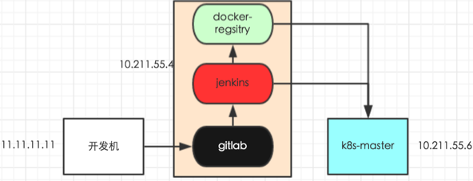

# docker 、jenkins、gitlab 、k8s 、devops

运行架构流程：

gitlab -> jenkins -> docker -> k8s	

把编码上传到gitlab上，使用webhook链接jenkins自动去编译docker镜像，然后上传到harbor本地docker镜像库中，再自动下载docker镜像，使用k8s控制docker运行服务

- 在开发机开发代码后提交到gitlab
- 之后通过webhook插件触发jenkins进行构建，jenkins将代码打成docker镜像，push到docker-registry
- 之后将在k8s-master上执行rc、service的创建，进而创建Pod，从私服拉取镜像，根据该镜像启动容器

Gitlab 云管理的代码托管平台。是一个用于仓库管理系统的开源项目，使用Git作为代码管理工具，并在此基础上搭建起来的web服务。

Jenkind 开源CI&CD软件领导者， 提供超过1000个插件来支持构建、部署、自动化， 满足任何项目的需要。是一个开源软件项目，是基于Java开发的一种持续集成工具，用于监控持续重复的工作，旨在提供一个开放易用的软件平台，使软件的持续集成变成可能。

持续集成：

- 它是一个自动化的周期性的集成测试过程，从检出代码、编译构建、运行测试、结果记录、测试统计等都是自动完成的，无需人工干预；
- 保证团队开发人员提交代码的质量，减轻了软件发布时的压力；

jenkins作用:

- 持续、自动地构建/测试软件项目。
- 监控一些定时执行的任务。

Jenkins拥有的特性包括：

- 易于安装-只要把jenkins.war部署到servlet容器，不需要数据库支持。
- 易于配置-所有配置都是通过其提供的web界面实现。
- 集成RSS/E-mail通过RSS发布构建结果或当构建完成时通过e-mail通知。
- 生成JUnit/TestNG测试报告。
- 分布式构建支持Jenkins能够让多台计算机一起构建/测试。
- 文件识别:Jenkins能够跟踪哪次构建生成哪些jar，哪次构建使用哪个版本的jar等。
- 插件支持:支持扩展插件，你可以开发适合自己团队使用的工具。

容器：容器就是将软件打包成标准化单元，以用于开发、交付和部署。

- 容器镜像是轻量的、可执行的独立软件包 ，包含软件运行所需的所有内容：代码、运行时环境、系统工具、系统库和设置。
- 容器化软件适用于基于Linux和Windows的应用，在任何环境中都能够始终如一地运行。
- 容器赋予了软件独立性，使其免受外在环境差异（例如，开发和预演环境的差异）的影响，从而有助于减少团队间在相同基础设施上运行不同软件时的冲突。

Docker 可以让开发者打包他们的应用以及依赖包到一个轻量级、可移植的容器中，然后发布到任何流行的 Linux 机器上，也可以实现虚拟化。

- Docker的镜像提供了除内核外完整的运行时环境，确保了应用运行环境一致性，从而不会再出现“这段代码在我机器上没问题啊”这类问题；——一致的运行环境
- 可以做到秒级、甚至毫秒级的启动时间。大大的节约了开发、测试、部署的时间。——更快速的启动时间
- 避免公用的服务器，资源会容易受到其他用户的影响。——隔离性
- 善于处理集中爆发的服务器使用压力；——弹性伸缩，快速扩展
- 可以很轻易的将在一个平台上运行的应用，迁移到另一个平台上，而不用担心运行环境的变化导致应用无法正常运行的情况。——迁移方便
- 使用Docker可以通过定制应用镜像来实现持续集成、持续交付、部署。——持续交付和部署

Docker包括三个基本概念：

- 镜像（Image）
  - 镜像是构建 Docker 容器的基石。用户基于镜像来运行自己的容器。镜像也是 Docker 生命周期中的“构建”部分。镜像是基于联合文件系统的一种层式结构，由一系列指令一步一步构建出来。
- 容器（Container）
  - 镜像是 Docker 生命周期中的构建或者打包阶段，而容器则是启动或者执行阶段。 容器基于镜像启动，一旦容器启动完成后，我们就可以登录到容器中安装自己需要的软件或者服务。
- 仓库（Repository）
  - Registry 分为公共和私有两种；Docker 公司运营公共的Registry 叫做 **Docker Hub**。

`docker ps` 查看正在运行的容器

`docker stop`停止正在运行的容器

`docker start`启动容器

`docker ps -a`查看终止状态的容器

`docker rm -f webserver`命令来移除正在运行的容器

`docker list` 列出本地镜像

`docker rmi` 删除的镜像

`docker run -it --name=mycentos centos` 启动容器

`docker images` 查看本地镜像

  -i：表示进入容器

  -t：表示容器启动后会进入其命令行。加入这两个参数后，容器创建就能登录进去。即分配一个伪终端。

  -d：在run后面加上-d参数,则会创建一个守护式容器在后台运行（这样创建容器后不会自动登录容器，如果只加-i        		-t两个参数，创建后就会自动进去容器）。

  -v：表示目录映射关系（前者是宿主机目录，后者是映射到宿主机上的目录），可以使用多个－v做多个目录或文		件映射。注意：最好做目录映射，在宿主机上做修改，然后共享到容器上。

  -p：表示端口映射，前者是宿主机端口，后者是容器内的映射端口。可以使用多个－p做多个端口映射

Kubernetes 是一个开源的，用于管理云平台中多个主机上的容器化的应用，Kubernetes的目标是让部署容器化的应用简单并且高效（powerful）,Kubernetes提供了应用部署，规划，更新，维护的一种机制；能够自主的管理容器来保证云平台中的容器按照用户的期望状态运行着。

Docker是一个开源的应用容器引擎，开发者可以打包他们的应用及依赖到一个可移植的容器中，发布到流行的Linux机器上，也可实现虚拟化。

k8s是一个开源的容器集群管理系统，可以实现容器集群的自动化部署、自动扩缩容、维护等功能。

kubernetes去管理Docker集群，即可以将Docker看成Kubernetes内部使用的低级别组件。

DevOps（英文Development和Operations的组合）是一组过程、方法与系统的统称，用于促进开发（应用程序/软件工程）、技术运营和质量保障（QA）部门之间的沟通、协作与整合。它的出现是由于软件行业日益清晰地认识到：为了按时交付软件产品和服务，开发和运营工作必须紧密合作。

k8s:

 	1. kubernetes总架构图 2. kubernetes 各组件介绍 2.1 Master 节点 Master是kubernetes的大脑，运行的Deamon 服务包括kube-apiserver、kube-scheduler、kube-contronller- manager、etcd和pod网络 2.1.1 各组件介绍 API Server（kube-apiserver） API Server提供HTTP/HTTPS RESTful API，即Kubernetes API。

功能：

自动化部署、扩展和管理容器应用、资源调度、部署管理、服务发现、扩容缩容、监控。

数据卷、应用程序健康检查、复制应用程序实例、弹性伸缩、服务发现、负载均衡、滚动更新、服务编排、资源监控、提供认证和授权。                  	

对象组建：

Pod、Service、Volume、Namespace、Lable

ReplicaSet、Deployment、StatefulSet、DaemonSet、Job

