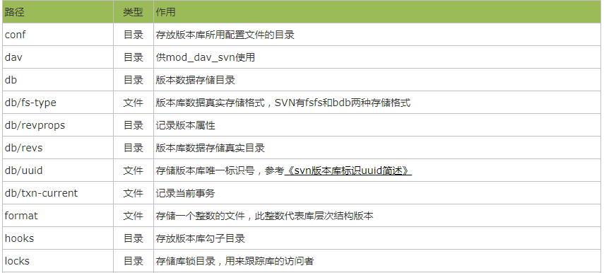

# svn

**第一步：通过yum命令安装svnserve**

```java
yum -y install subversion
```

若需查看svn安装位置：

```
rpm -ql subversion
```

**第二步：创建版本库目录**

```
mkdir /usr/local/nes
```

**第三步：创建svn版本库**

```
svnadmin create /usr/local/nes/svntest
```

创建成功后，进入xxxx目录下

```
cd /usr/local/nes/svntest
```

进入目录，可以看见如下文件信息：

```
total 24
drwxr-xr-x 2 root root 4096 May  2 13:48 conf
drwxr-sr-x 6 root root 4096 May  2 13:48 db
-r--r--r-- 1 root root    2 May  2 13:48 format
drwxr-xr-x 2 root root 4096 May  2 13:48 hooks
drwxr-xr-x 2 root root 4096 May  2 13:48 locks
-rw-r--r-- 1 root root  229 May  2 13:48 README.txt
```



**第四步：配置修改**

```
cd /usr/local/nes/svntest/conf
```

conf目录下，一共存放三份重要的配置文件，如下：

```
total 12
-rw-r--r-- 1 root root 1080 May  2 13:48 authz
-rw-r--r-- 1 root root  309 May  2 13:48 passwd
-rw-r--r-- 1 root root 3090 May  2 13:48 svnserve.conf
```

authz：负责账号权限的管理，控制账号是否读写权限

passwd：负责账号和密码的用户名单管理

svnserve.conf：svn服务器配置文件

1.编辑 authz 文件

```
[/]   表示根目录，即 /var/svnrepos

nes = rw  表示用户luo对根目录具有读写权限。
```

2.编辑 passwd 文件

```
用户名为：nes，认证密码为：123456
nes = 123456
```

3.编辑 svnserve.conf 文件（注意：配置的前面不能有空格，一定要顶格写）

```
anon-access = none：表示禁止匿名用户访问。

auth-access = write：表示授权用户拥有读写权限。

password-db = passswd：指定用户名口令文件，即 passwd 文件。

authz-db = authz：指定权限配置文件，即 authz 文件。

realm = /var/svnrepos：指定认证域，即 /var/svnrepos 目录。
```

**第五步：防火墙开启（这里以iptable防火墻为例）**

```
vi /etc/sysconfig/iptables
```

添加配置信息

```
-A INPUT -p tcp -m state --state NEW -m tcp --dport 3690 -j ACCEPT
```

```
systemctl restart iptables.service #重启防火墙使配置生效
```

centos7开启防火墙：

```
firewall-cmd --permanent --add-port=3690/tcp
```

**六：启动svn服务器**

```
svnserve -d -r /var/svnrepos
```

启动成功后，可用ps -aux查看服务启动是否成功

```
ps -ef | grep 'svnserve'
```

查看svn服务端口是否启动

```
netstat -apn | grep 3690
```

**七：客户端访问svn服务器**

输入地址：svn://ip地址:3690/svntest

或者在linux服务器:

```
svn co svn://ip地址:3690/svntest
```


注：输入账号密码后，提示 svn: Authorization failed解决办法

把authz 文件 [/] 改为 [\] 试


# 防火墙篇

**一.Linux下开启/关闭防火墙命令**

1) 永久性生效，重启后不会复原

```
开启： chkconfig iptables on

关闭： chkconfig iptables off
```

2) 即时生效，重启后复原

```
开启： /etc/init.d/iptables start

关闭： /etc/init.d/iptables stop
```

3)开启相关端口

修改/etc/sysconfig/iptables 文件，添加以下内容：

```
-A RH-Firewall-1-INPUT -m state --state NEW -m tcp -p tcp --dport 80 -j ACCEPT

-A RH-Firewall-1-INPUT -m state --state NEW -m tcp -p tcp --dport 22 -j ACCEPT
```


**二.UBuntu关闭防火墙**

iptables -A INPUT -i !   PPP0   -j ACCEPT


**三.CentOS Linux 防火墙配置及关闭**

```
/sbin/iptables -I INPUT -p tcp –dport 80 -j ACCEPT

/sbin/iptables -I INPUT -p tcp –dport 22 -j ACCEPT

/etc/rc.d/init.d/iptables save
```

这样重启计算机后,防火墙默认已经开放了80和22端口

这里应该也可以不重启计算机：

```
/etc/init.d/iptables restart
```

查看防火墙信息：

```
/etc/init.d/iptables status
```

关闭防火墙服务：

```
/etc/init.d/iptables stop
```

永久关闭

```
chkconfig --level 35 iptables off
```


**四.centos 7 防火墙**

```
systemctl stop firewalld.service
systemctl disable firewalld.service
```

*centos 7 查看防火墙状态*

firewall-cmd --state

 