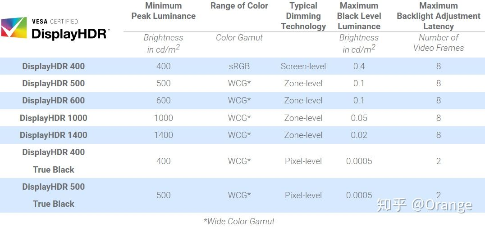

# 显示器

### 尺寸

**23英寸** 的显示器更适合玩LOL、吃鸡、CS GO等电竞游戏；

**27英寸 **的显示器比较适合日常办公、看电影；

**31.5英寸** 的显示器近距离观看需要抬头，时间久了会比较累。

**带鱼屏 **指屏幕比列为21：9或32：9的显示器，特点是非常的长，跟带鱼一样，所以被调侃为“带鱼屏”。这种屏幕由于较长，所以一屏能显示更多的内容。

这种屏幕的好处是：

1.多开网页或者软件、游戏时，同屏能显示更多的内容，因此很适合用来工作。

2.如果能找到21：9的电影片源，看电影会非常爽。

3.支持市面主流网络和单机游戏。LOL和绝地求生、cs go等都能有效扩宽左右视野。

缺点：

1.由于分辨率高，所以玩游戏时对显卡要求更高。


### 色域

往简单了说就是显示器显示的色彩好不好，常见的色域有两种表示的方法：

SRGB色域和NTSC色域

他们俩表示的都是色彩的范围大小，只不过是标准不同罢了，一般我们认为72%NTSC覆盖的范围≈100%sRGB色域覆盖的范围

采用NTSC色域的显示器色彩浓郁，更适合看视频，看电影；采用sRGB色域的显示器色彩会更准一些，适合修照片。


### 色差

以deltaE值作为单位，这个值越小，色彩还原越准确，一般绘图用的显示器deltaE值要小于3。


### 分辨率

**1080** 分辨率：

**1080P** 分辨率：

**2K** 分辨率：2560*1440；文字工作者和程序员。

超过27英寸的显示器最好也选择2K分辨率的屏幕，否则近距离使用电脑时会有颗粒感。

**4K** 分辨率：


### 刷新率

一般显示器分60HZ和144HZ，144HZ的显示器更贵，但在玩游戏的时候会比60hz有更顺滑，更清晰的画面体验，所以144hz（或者更高的240hz）的显示器被称为电竞显示器。

现在绝大多数的显示器都是60hz的，如果你玩FPS射击类游戏的话，选60hz就够了，如果主要就是玩FPS射击类游戏，建议你选144hz乃至更高刷新率的显示器。


### 灰阶响应时间

就是显示器从上一帧图片切换到下一帧图片的间隔时间，以毫秒ms作为单位，这个时间越短，说明画面切换的越快越干净。如果灰阶响应时间过长，画面就会出现拖沓，模糊，拖影的现象。普通显示器为6-8ms，专业电竞显示器为1ms。


### 面板

TN面板的优点是：液晶分子偏转速度非常快，所以灰阶响应时间很短。缺点是：色域窄，画面色彩苍白，可视角度很小，有条件的可以用手机屏幕对比一下老式的便宜的笔记本电脑屏幕。

由于TN面板唯一的优点就是响应速度快，所以现在主流的144hz的电竞显示器都是TN面板，价格也比较便宜。


IPS面板的优点：色彩显示效果好，可视角度大，色彩准。缺点是：容易漏光，黑色不够纯正。

这类显示器由于色彩好，可视角度大，所以也是现在应用最广的显示器面板。


FastIPS，从英文字面意思可以理解为“IPS快速液晶面板”，FastIPS是由知名面板厂家友达光电推出的，为各大显示器厂商提供面板，FastIPS液晶分子的排列、电极排布与普通IPS有点类似，通过降低液晶层厚度与优化电压等方式来实现更快速的响应，通常FastIPS液晶分子偏转速度差不多是普通液晶的4倍速度左右，所以在响应时间也就快上不少了。对于Fast IPS面板官方标称GTG灰阶响应时间可以达到真正1ms响应，不过实际差不多2-3ms左右，几乎和常见TN面板差不多的。

```
优点：响应时间相比NanoIPS略快一点点。

缺点：由于FastIPS追求响应时间，可能会牺牲色彩表现，不过好在基于IPS，色彩方面无疑相比TN是要好的。
```


NanoIPS，是LG推出的一种新型的IPS液晶面板，除了LG自家有采用NanoIPS面板的显示器产品，为了抢占市场，目前很多品牌显示器也采用LG生产的NanoIPS面板，Nano IPS面板完全可以看作是普通IPS面板的升级改进产品，它并不是简单的优化来实现效果的，过程更为复杂，相比普通IPS，它在屏幕的LED背光模组上增加了新型的纳米颗粒，能够吸收过量的光波，改进显示光输出的纯度与强度，提升屏幕色彩精度，并提供更加通畅、丰富、真实的画面效果。至于标注1ms的GTG灰阶响应时间也是略有水分的，实际也差不多3ms左右，基本近似TN面板响应速度的效果。值得一提的是，NanoIPS的色域方面能够覆盖更广，色准也会好很多，无论在响应时间还是色彩表现力都要优于普通IPS，不过最大的不足就是NanoIPS对比度会略低，画面暗部细节比较差，如果您比较追求对比度参数，那么VA面板无疑是更好的选择，通常选择IPS与TN屏幕的人群，基本不会太关注对比度。

```
优点：色彩表现出色，无论是色域色准、亮度均匀度还是亮光表现都比较优秀，且响应时间接近TN，综合表现还是不错的。

缺点：对比度低，画面暗部细节比较差，是IPS通病。
```


VA面板有两种：MVA面板和PVA面板，PVA是三星改良的MVA面板。这类面板算是TN面板和IPS的折中方案，优点是色彩准确，对比度高，可视角度较大，漏光少，黑色纯正。缺点是响应时间比IPS还要长，如果玩射击游戏来回切换画面会容易产生拖影。


PLS面板是三星独家研制的面板，类似IPS面板。

### HDR

HDR 是指高动态范围（High-dynamic-range），对应的显示技术是 SDR（标准动态范围，Standard-dynamic-range），其中 HDR 更接近人眼的视觉效果，能够同时呈现更丰富的亮部细节和暗部细节，不至于亮部过亮、暗部太暗。


**HDR10** 是一种使用最普遍、最广泛的 HDR 格式，它是指显卡与显示器之间传输 HDR 内容的协议与标准，这是一个开放标准，不需要支付任何版权、认证费用。支持 HDR10 只能表明显示器可以接受 HDR 片源输入，但并不能明确显示器输出 HDR 的效果怎么样！


视频电子标准协会 VESA 推出的DisplayHDR 认证才是真正衡量显示器 HDR 效果的标准，它是在支持 HDR10 的基础之上，进而根据显示器的亮度、色域、色深、调光类型、黑电平（black level）等划分等级，各等级以峰值亮度来命名。


**HDR400** 是最基础的，仅要求显示器峰值亮度不低于 400nit、原生 8bit 色深、95%sRGB 色域、全局调光。


```
全局调光：屏幕只有一个背光分区，只能全屏统一调节，要么全屏更亮，要么全屏更暗。

区域调光：屏幕背光划分为多个区域，各区域能够独立调节亮度。
```


可以看出 HDR400 的认证要求其实是非常低的，和稍好点的普通显示器并没有多大差别，也正因为门槛低，因此市面上贴了 VESA 认证徽标的显示器基本上都是 HDR400！而普通消费者看到这个认证徽标就会理所当然地以为很牛逼，而普通消费者看到这个认证徽标就会理所当然地以为很牛逼，因此很容易被忽悠和误导！


**HDR500** 及以上，认证要求才有了质的提高：区域调光，10bit 色深，90% DCI-P3 色域等，其中最重要的是区域调光，能够极大地提高对比度和动态范围，实现真正的 HDR 体验，而 10bit 色深和 P3 广色域同时也能带来更好的色彩观感。但这些都是 HDR400 认证要求所没有的！


不同级别 DisplayHDR 大致区别如下图:




综上，凡是没有 VESA 认证的 HDR 基本上都是耍流氓！而最低端的 VESA HDR400 也可以说是一个极易误导消费者的标准！


此外，要实现 HDR 还需要处理器、显卡、系统、线材、片源等一系列的支持，任何一个环节出错，最终都不能看到 HDR 内容！其实大部分人买回来 HDR10 或 HDR400 的显示器，几乎从来都不会去开 HDR！


### 总结

1.144hz/1ms的电竞显示器对CF、CS GO、绝地求生、守望先锋等PFS射击游戏来说，效果区别非常大，是那种用了之后眼睛就再也受不了60hz显示器的那种，当然前提是你的显卡得支持这么高的帧数。

2.IPS屏幕色彩很好，可视角度也很大，但漏光是IPS的通病，你买到的显示器漏光严重与否，很大程度看运气。而且轻微漏光日常使用看不出区别，所以不用太纠结。

3.普通玩家选择IPS或者VA面板的显示器就够了，不是PFS射击类游戏玩家不用盲目追求144hz/1ms，效果不明显。


借呗：

[有道云笔记 (youdao.com)](https://note.youdao.com/ynoteshare/index.html?id=4efbaf5f96cc34d4a17fd261d08dfb80&type=note&_time=1641345543739)

[(20 封私信 / 42 条消息) 显示器的 HDR10 HDR400 HDR600 和 HDR1000 都有什么区别？ - 知乎 (zhihu.com)](https://www.zhihu.com/question/325302989/answer/1188574938)

