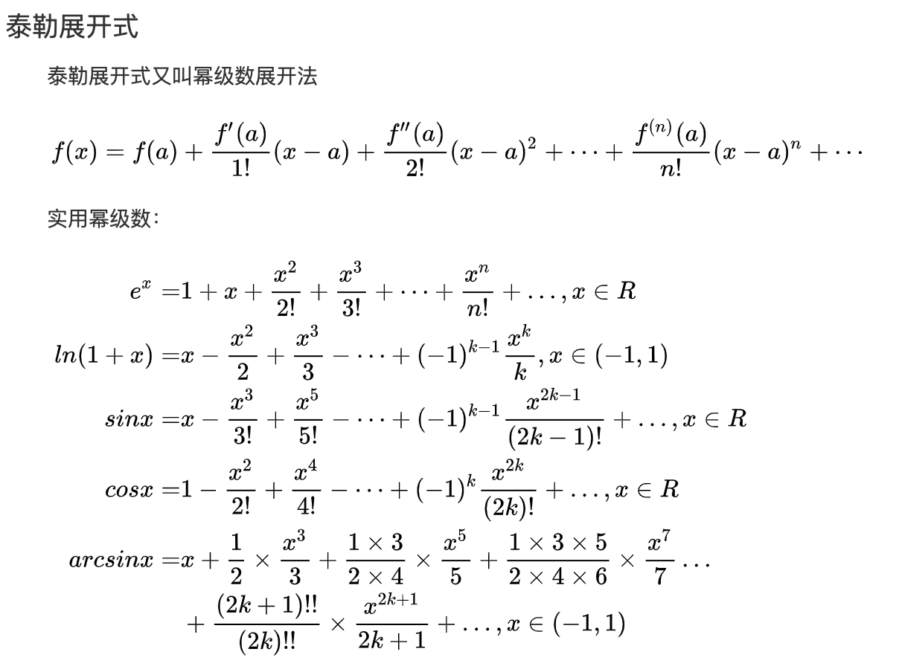

#### 初中公式

```
Δ=b²-4ac

求根公式 x=(-b±√Δ)/2a

当b²-4ac＞0时 则方程ax²+bx+c=0 有2个不相同的解
当b²-4ac=0时 则方程ax²+bx+c=0 有2个相同的解
当b²-4ac＜0时 则方程ax²+bx+c=0 无解

△y描述的是函数的增量，dy描述的是切线的增量

△y=f(x0+△x)-f(x0)
dy=f'(x0) △x
```

```
正三角形面积：S=（（√3）/4）a²
圆周长：2πr
圆面积：πr^2
球面积：4πr^2
球体积：3/4*πr^3
```

#### 初中指对数公式

```
lnx^x = xlnx
e^lnx = x
lnab = lna + lnb | ln(a/b) = lna - lnb
e^x * e^y = e^(x + y)
e^x / e^y = e^(x - y)
e^(x * y) = (e ^ x) ^ y

求和公式：Sn = 首项/1-公比
```

```
常用公式：
∫e^(-x^2)dx = (√π)/2

```


#### 导数

```
圆葱求导法
```

```
1.y=c(c为常数)	--	y'=0
2.y=x^n				--	y'=nx^(n-1)
3.y=a^x				--	y'=a^xlna
y=e^x					--	y'=e^x
4.y=logaX(a为底数，x为真数)	--	y'=1/(x*lna)
y=lnx					--	y'=1/x

5.y=sinx	--	y'= cosx
6.y=cosx	--	y'= -sinx

7.y=tanx	--	y'= 1/cos^2x = sec^2x
8.y=cotx	--	y'= -1/sin^2x = -csc^2x

8.y=secx	--	y'= secx*tanx
8.y=cscx	--	y'= -cscx*cotx

secx = 1/cosx
cscx = 1/sinx

09.y=arcsinx	--	y'=1/√(1-x^2)
10.y=arccosx	--	y'=-1/√(1-x^2)

11.y=arctanx	--	y'=1/(1+x^2)
12.y=arccotx	--	y'=-1/(1+x^2)

13.y=u^v			--	y'=v'*u^v*lnu+u'*u^(v-1)*v
```


#### 基本函数

```
反对幂指三
```

微分、拉格朗日定理、泰勒定理、罗尔定理、函数的极限与数列极限、反函数

1.函数

2.数列与极限

3.导数：和差积商

```
(uv)`= u`v + uv`
(u/v)` = u`v - uv` / v^2
```


#### 三角函数及反函数

```
正弦：sin - arcsin
余弦：cos - arccos
正切：tan - arctan

余割：csc = 1/sin
正割：sec = 1/cos
余切：cot = 1/tan

tan = sin/cos = sec/csc = 1/cot

sin^2+cos^2 = sec^2-tan^2 = csc^2-cot^2 = 1

(1-cos)/sin = sin1/2 / cos1/2

```

#### 三角函数

```
两角和公式
sin(A+B) = sinA·cosB + cosAxinB
sin(A-B) = sinA·cosB - xinBcosA
 
cos(A+B) = cosAcosB - sinAxinB
cos(A-B) = cosAcosB + sinAxinB

tan(A+B) = (tanA+tanB)/(1-tanAtanB)
tan(A-B) = (tanA-tanB)/(1+tanAtanB)

cot(A+B) = (cotAcotB-1)/(cotB+cotA)
cot(A-B) = (cotAcotB+1)/(cotB-cotA)

1、cos(α+β) = cosα·cosβ-sinα·sinβ
2、cos(α-β) = cosα·cosβ+sinα·sinβ
3、sin(α±β) = sinα·cosβ±cosα·sinβ
4、tan(α+β) = (tanα+tanβ)/(1-tanα·tanβ)
5、tan(α-β) = (tanα-tanβ)/(1+tanα·tanβ)


倍角公式
sin2A = 2sincos = 2tan / 1+tan^2
cos2A = cos^2-sin^2 = 2cos^2-1 = 1-2sin^2 = 1-tan^2 / 1+tan^2
tan2A = 2tan / 1-tan^2


半角公式
sin(A/2) = ±√ ((1-cos)/2) 
cos(A/2) = ±√ ((1+cos)/2) 
tan(A/2) = ±√ ((1-cos)/((1+cos)) = sin/(1+cos) = (1-cos)/sin
cot(A/2) = ±√ ((1+cos)/((1-cos)) = sin/(1-cos) = (1+cos)/sin


积化和差
2sinAcosB = sin(a+b) + sin(a-b)
2cosAxinB = sin(a+b) - sin(a-b)

2sinAxinB = cos(a-b) - cos(a+b)
2cosAcosB = cos(a-b) + cos(a+b)


和差化积
sinA + xinB = 2sin((A+B)/2) * cos((A-B)/2)
cosA + cosB = 2cos((A+B)/2) * sin((A-B)/2)
tanA + tanB = sin(A+B) / cosAcosB


诱导公式
sin(-a) = -sin(a)
cos(-a) = cos(a)
tan(—a) = -tan(a)

sin(π/2 + a) = cos(a)
cos(π/2 + a) = -sin(a)
sin(π/2 - a) = cos(a)
cos(π/2 - a) = sin(a)
tan(π/2 + a) = -cota
tan(π/2 - a) = cota

sin(π-a) = sin(a)
cos(π-a) = -cos(a)
sin(π+a) = -sin(a)
cos(π+a) = -cos(a)
tan(π+a) = tan(π-a)= tana

tanx = sinx/cosx
sinx = tanxcosx 


万能公式
sinA = (2tan(a/2))/(1+tan^2(a/2))
cosA = (1-tan^2(a/2))/(1+tan^2(a/2))
tanA = (2tan(a/2))/(1-tan^2(a/2))


其它公式
a*sin(a)+b*cos(a) = sqrt(a^2+b^2)sin(a+c) [其中，tan(c)=b/a]
a*sin(a)-b*cos(a) = sqrt(a^2+b^2)cos(a-c) [其中，tan(c)=a/b]
1+sin(a) = (sin(a/2)+cos(a/2))^2
1-sin(a) = (sin(a/2)-cos(a/2))^2


降幂公式
sin^2 = (1-cos(2α))/2 = versin(2α)/2 (正矢) versinθ = 1 − cosθ
cos^2 = (1+cos(2α))/2 = covers(2α)/2 (余矢) coversθ = 1 − sinθ
tan^2 = (1-cos(2α))/(1+cos(2α))


锐角三角函数公式
sin α=∠α的对边 / ∠α斜边
cos α=∠α的邻边 / ∠α斜边
tan α=∠α的对边 / ∠α的邻边
cot α=∠α的邻边 / ∠α的对边


推导公式
tanα+cotα = 2/sin2α
tanα-cotα = -2cot2α
1+cos2α = 2cos^2α
4-cos2α = 2sin^2α
1+sinα = (sinα/2+cosα/2)^2 = 2sinA(1-sin2a)+(1-2sin2a)sinA
```

#### 中值定理

```
柯西定理、
拉格朗日中值定理、
罗尔定理
```


#### 泰勒公式



```
泰勒简化版
sinx = x - x^3/6 + o(x^3)	
cosx = 1 - x^2/2 + x^4/24 o(x^4)
tanx = 1 + x^3/3 + o(x^3)

arcsinx = x + x^3/6 + o(x^3)
arctanx = 1 - x^3/3 + o(x^3)

ln(1+x) = x - x^2/2 + x^3/6 + o(x^3)
e^x = 1 + x + x^2/2 + x^3/6 + o(x^3)
(1+x)^a = 1 + ax + a(a-1)x^2/2 + o(x^2)
```


#### 等价无穷小代换公式

```
前提：x ~ 0 

sinx ~ arcsinx ~ tanx ~ arctanx ~ (e^x)-1 ~ ln(x+1) ~ x  遇到ln有限考虑化简为ln(x+1)
1-cosx ~ (1/2)(x^2) ~ secx-1
1-cosx^a ~ (a/2)x^2
(a^x)-1 ~ xlna
(1 + bx)^(a-1) ~ abx
loga(1+x) ~ x/lna
(1+x)^a - 1 ~ ax

x - sinx ~ x^3/6
x－arcsinx ～ -(x^3)/6
tanx－sinx ～ (x^3)/2
tanx－x ～ (x^3)/3

xlnx ~ 0
x^tlnx ~ 0

lim u^v = e^vlnu ~ e^v(u - 1)

lim x-∞ (1+a/x)^bx+d ~ e^ab
```

#### 洛必达法则

```
法则1: 

f(x) -> 0 or ∞
g(x) -> 0 or ∞
满足0/0  ∞/∞形式

0·∞ = 0/(1/∞)

∞-∞ : 分母通分，没有分母创造分母通分

∞^0 0^0 1^0 : limU^V = e^limVlnU = e^limV(U-1)
ln(x-(1+x^2)^(1/2))` = 1/(1+x^2)^(1/2)

1)f'(x) / g'(x) 不存在，不适用
2)多次求导 -- 一题运算中可进行多次洛操作
3)每次求导之后检查是否满足
4)等价无穷小替换
5)把区域常数的项外移

```

公式比较：lnX < √ X < X^2 <  e^X

#### 极限法则

```
1.利用函数的连续性求函数的极限（直接带入即可）
2.利用有理化分子或分母求函数的极限
3.利用两个重要极限求函数的极限
4.利用无穷小的性质求函数的极限
	性质1：有界函数与无穷小的乘积是无穷小
	性质2：常数与无穷小的乘积是无穷小
	性质3：有限个无穷小相加、相减及相乘仍旧无穷小
5.分段函数的极限
	分别求出，每段函数的导数，再看分段点的左右极限，如果左右极限相等且极限存在，则分段点出的极限存在。
6.利用抓大头准则求函数的极限
	只看函数的最大次数的项。
7.利用洛必达法则求函数的极限
	性质0/0型：函数的值的比=函数导数值的比。
	性质∞/∞型：函数的值的比=函数导数值的比。
	不定式型：极限还有
		0*∞：可将乘积中的无穷小或无穷大变形到分母上。
		∞-∞：把两个无穷大变形为两个无穷小的倒数，再通分使其化为型0/0。
		1^∞：一般为带自变量的幂次函数，可通过添加e^ln化简，再利用等价无穷小公式，两个重要极限等进行再化简。
		0^0：通过添加e^ln化简再洛。
		∞^0：化简再洛。
		
		等类型。经过简单变换，它们一般均可化为0/0型或∞/∞型。
8.利用定积分的定义求函数的极限

9.分子分母都趋于无穷大、自变量也趋于无穷大时，可使用将分子分母同时除以最高此项的方法求极限。

提出不为0的因式、创造条件实现等价无穷小、
```


#### 两个重要极限

```
lim(x~0) sinx/x = 1
lim(x~0) (1+x)^(1/x) = e 或 lim(x~∞)(1+1/x)^x = e  效果等同于 ln(x + 1) ~ x 等价无穷小公式
```


辅导书类：李正元复习全书 李永乐660题 李永乐线代辅导讲义 李永乐王式安概率论辅导讲义 

试卷类:张宇数学真题大全解（有三十年的数学考研真题）李永乐6+2 李正元400题 张宇8+4 合工大16-17两年共创和超越试卷共20套 张宇最后一套卷


#### 总结

```
求极限时，不能出现化简后为0的情况，如果有则变换化简方法。

求函数的极值时：一阶导数为0时，去极值，在用二阶导数不为0，判断极值是否存在。

拉格朗日定理：(a,b) , f(a)-f(b) = f(x)'·(a-b)

零点定理：(a,b) , f(a)·f(b)<0, 存在f(x)=0

罗尔定理：(a,b) , f(a) = f(b), 存在f(x)'=0

当函数有n个解时，根据罗尔定理，f(x)'=0有n-1个，f(x)''=0有n-2个，以此类推。

积分定义式：lim n~∞ E(1~n)   f[a+i/n(b - a)]·(b-a)/n = |a~b f(x)dx

当a=0,b=1时，lim n~∞ E(1~n)   f[i/n]·(1)/n = |0~1 f(x)dx

换元积分法、分部积分法
```


`积分一般为函数的导数，要化为原式在求值。`

#### 不定积分

```
换元法；
∫x/√1+x^2 = √1+x^2
```


#### 定积分

```
换元法；分部积分法：∫a~b udv = uv|a~b - ∫a~b vdu

对于利用分部积分法求积分时，遇到无限的情况，
1）遇到与首项相同时，可求其k倍化简；
2）化简变形，dx所匹配的形式，在直接求积；

积分时，注意要保证内外的x值相同才可以。
```


反常积分：只要一个极限不存在，则积分发散


#### 积分的应用

```
求二维图形、三位图形的面积、体积；求函数在(a,b)以x、y为轴旋转围成的图形的体积。
```


#### 向量

齐次方程

隐函数求导、参数方程求导

换元积分法、分部积分法( ∫udv = uv - ∫ vdu )、有理函数积分


对于先证明在**求极限的递归形**数列极限题：

1.技巧型化简，求出上界或下界。

2.用Xn - Xn-1,判断数列的单调性。

3.将A带入Xn+1 与 Xn 的关系式，求出A便为极限。

或者用"先斩后奏"法。


n项或多项相加求极限，用夹逼准则。


#### 多元函数微分学

某点求偏导数值用定义法，分别对x，y利用定义法。

f'x(Xo + ∆x,Yo) -  f'x(Xo,Yo) / ∆x

f'y(Xo,Yo + ∆y) -  f'y(Xo,Yo) / ∆y

偏导数：dz = A∆x + B∆y = ∂z/∂x•dx +  ∂z/∂y•dy（公式法）(全微分方程)


判断一点是否可微：

1）全增量：∆z = f(Xo + ∆X, Yo  + ∆Y) -  f(Xo, Yo)

2）线性增量：A∆x + B∆y，A = f'x(Xo, Yo)，Y =  f'y(Xo, Yo)

3）lim<∆x-0,∆y-0> ∆z - (A∆x + B∆y) / √(∆x^2 + ∆y^2) == 0，则可微。

即全增量 == 线性增量，可微。


判断偏导数是否连续：

1）定义法：f'x(Xo,Yo) ,f'y(Xo,Yo) 

2）公式法：f'x(X,Y) ,f'y(X,Y) 

3）f'x(Xo,Yo) == f'x(X,Y) ，f'y(Xo,Yo) == f'y(X,Y) 

即某点偏导数值 == 偏导数某点值，连续。


链式求偏导：

∂z/∂x = ∂z/∂u•∂u/∂x + ∂z/∂v•∂v/∂x


一般：显函数求导用链式，隐函数求导用上面的公式法。

∂z/∂x = - F'x / F'z


z函数的整体是由x，y一同构成。


求极值

1）对x，y求偏导 = 0，求出点坐标。

2）将点坐标分别带入二阶偏导中，f‘x‘x，f’x‘y，f’y‘y，得到A，B，C

3）∆ = B^2 - AC

∆ < 0，极值，A < 0，极大值；A > 0，极小值；

∆ > 0，非极值

∆ = 0，失效

失效后可以另寻两个区域，如y = x，y = -x，将失效的点坐标带入到方程中判断。


拉格朗日乘除法：解决求条件极值

1）写出方程：F(x,y,z,λ,μ) = 原方程 + λ条件方程1 + μ条件方程2

2）求出各个变量的偏导数。

3）计算出x，y，z的值，按照原方程求出极值。


#### 多重积分

一重积分函数"∫”表示对应x轴的坐标，函数与x轴围成的面积，当f(x)为奇函数时并在y轴对称区域，面积为0。

一重积分可水平加减拆分。


二重积分所表示的是体积的函数，"∫∫”部分表示的是x,y的面积，f(x,y)dx表示的是z轴方向上曲面的面积，二者相乘为图形的体积。

f(x,y)部分判断奇偶性时，将无关部分视为常数，分别独立判断。

二重积分中，

1）在∫∫关于y轴对称时，f(x,φ)部分为，奇函数的积分为0，偶函数为2倍。

2）在∫∫关于x轴对称时，f(φ,y)部分为，奇函数的积分为0，偶函数为2倍。

积分计算时，可进行加减拆分。

极坐标系下：

```
x = rcosΘ, y = rsinΘ

x^2 + y^2 = r^2
```

前 "∫" 上下标表示弧度，后 "∫" 上下标均为r的长度。

积分内部的f(x,y)对应的坐标点函数均在围成的图形内部 min(x,y) ≤ f(x,y) ≤ max(x,y)。

对应f(x,y)不方便变坐标求积分时，通常可以直接化简，例如：直接视为圆函数的一部分。

将第二部分视为一重积分计算。关于 f(z,y) 或 f(z,x) 的函数看作f(x,y)图像。

直角坐标系下，dφ对应哪个轴， "∫" 上下标则对应哪个轴的函数。


#### 微分方程

通解中的独立常数等于阶数。

求解首先找到dy/dx 形式，在判断用什么方法求。

将整式变形为 dy/dx 形式，得到y/x的形式换元，得到du/u = dx/x 的等式，两边同时积分，求出结果。


1）变量可分离型：化为 dy/dx 形式

2）可化为变量可分离型：通过 u 化简为 dy/dx 形式

3）一阶线性微分方程：形如y' + p(x)y = q(x)的方程求通解，利用公式

```
y = e^-∫p(x)dx [∫e^∫p(x)dx · q(x)dx + c]
```

4）伯努利方程：y' + p(x)y = q(x)•y^n **=> u = y^1-n****

变形为：(y^-n)•y' + p(x)(y^1-n) = q(x)  

终得：1/1-n•dz/dx + p(x)z = q(x)


二阶可降阶降阶方程：

y'' = f(x,y')型，化为y' = p(x), y'' = p(x)' 

y'' = f(y,y')型，化为y' = p(x), y'' = dp/dy•p(x)


高阶线性微分方程：

y'' + p(x)y' + q(x)y = f(x) 称为二阶变系数线性微分方程， p(x)、q(x)为自由项。

y'' + p(x)y' + q(x)y = 0 为齐次方程。

y'' + p(x)y' + q(x)y = f(x) 为非齐次方程。

齐通 + 非齐特 = 非齐通

非齐特 + 非齐特 = 非齐特


齐次方程通解：

特征方程：λ^2 + pλ + q = 0，λ为特征根，∆ = q^2 - 4q

∆ > 0 ,即 特征方程有两个根 y = C1e^λ1x + C2e^λ2x

∆ = 0 ,即 特征方程有一个根 y = (C1 + xC2)•e^λx

∆ < 0 ,即 特征方程无根(共轭复根) y = e^ax•(C1cosßx + C2sinßx)


非齐次方程特解：

1）非齐次方程为 Pn(x)e^åx 形式。

特解为：y* = e^åx•Qn(x)•x^k

å≠λ1≠λ1，k = 0

å=λ1，å≠λ2，k = 1

å=λ1=λ2，k = 2

2）非齐次方程为 e^åx(Pm(x)cosßx + Pn(x)xinßx) 形式。

特解为：y* = e^åx(Ql1(x)cosßx + Ql2(x)xinßx)x^k

l = max{m,n}，Ql1(x),Ql2(x)分别为x的两个不同的l次多项式

å±ßi 不是特征根，k = 0

å±ßi 是特征根，k = 1


截距公式：Y - y = f'(x) (X - x)


点到直线距离公式：一点P(x0,y0)到直线l:Ax+By+C=0的距离为

d = |AXo + BYo + C| / √(A^2+B^2)


#### 级数

**正项级数**：

1/n	发散

1/nlnn	收敛

1/n^2	收敛


1）收敛原则：收敛数列单调不减，有界，Un = 0, Sn = S

∑Un收敛 与 部分和数列{Sn}有界：为充要条件。

若{Sn}有界，limSn = S

若{Sn}无界，limSn = +∞

2）比较判别法：Un ≤ Vn

大的收敛，小的必收敛；小的发散，大的必发散。

3）比较判别法极限形式：limUn / Vn = A

A=0，分母收敛，分子收敛。

A=+∞，分母发散，分子发散。

0<A<+∞，分子分母敛散度相同。

4）比值判别法：Un+1 / Un = ρ

ρ<1，收敛；ρ>1，发散；ρ=1，失效。

5）根植判别法：n√Un = ρ

ρ<1，收敛；ρ>1，发散；ρ=1，失效。


**交错级数**

{Un}单调不增，且limUn = 0


**任意级数**

各项可正可负可为0位任意级数。

∑|Un|收敛，∑Un 必收敛，绝对收敛。

∑Un 收敛，∑|Un|发散，条件收敛。

(-1)^n·a 发散


级数的项任意加括号后所得的新级数：

原级数收敛，新级数收敛，其和不变。

新级数发散，原级数发散。

新级数收敛，不能判断原级数。

从第一项起，两项一组收敛，原级数发散。


绝对收敛级数具有可交换性，和不变。


**幂级数**

∑Un(X) = ∑AnX^n = Ao + A1X + A2X^2 + … + AnX^n +...

∑Un(Xo)收敛，Xo为收敛点；∑Un(Xo)发散，Xo为发散点。

所有收敛点集合称为收敛域。

若Xo为收敛点，|X| < |Xo|的点，绝对收敛；|X| > |Xo|的点，发散。

|An+1 / An| = ρ，收敛半径为R。

ρ≠0，R = 1/ρ;

ρ=0，R = +∞;

ρ≠+∞，R = 0;

(-R,R)为收敛区间，单独讨论 ±R 处，得到收敛域。


**和函数**

求和公式：S(x) = ∑Un(x)

1）`和函数` 的倍数 = 倍数的 `和函数`

2）`和函数`的和差 = 和差的 `和函数` (下标需相同)


和函数变形：

1）通项、下标一起变

下标与通项取相反。

2）下标变、通项不变

将下标变化的 `多余项的Sn` 加在 `和函数` 的外面。

3）通项变，下标不变

将下标变化的 `多余次数的项` 乘在  `和函数`  的外面。


和函数在收敛区间内连续，可以包括端点。

和函数的积分，半径不变，域可能扩大。

和函数的导数，半径不变，域可能减小。


**幂级数展开式**

泰勒级数：f(x) = ∑f''''n阶(Xo)/n! •(X-Xo)^n